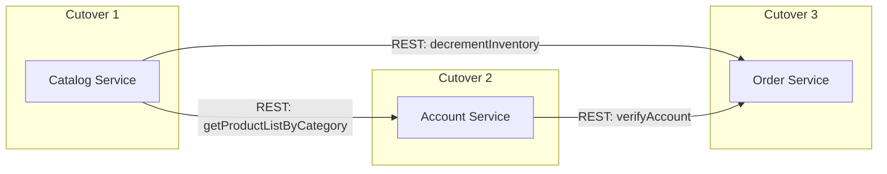
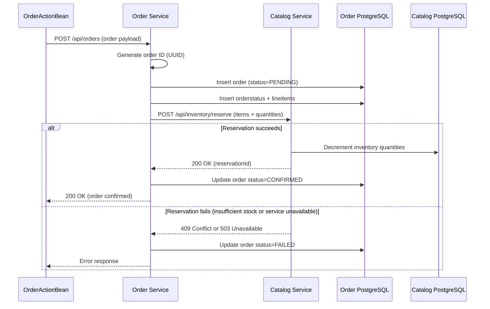
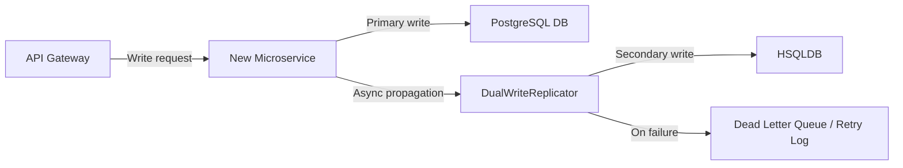

# Technical Specification

# 0. Agent Action Plan

## 0.1 Intent Clarification

### 0.1.1 Core Refactoring Objective

Based on the prompt, the Blitzy platform understands that the refactoring objective is to perform a **full monolith-to-microservices decomposition** of the MyBatis JPetStore 6 application — a Java web application currently packaged as a single WAR file (`jpetstore.war`) running on MyBatis 3.5.19, Spring 5.3.39/6.2.17, and Stripes 1.6.0 with an embedded HSQLDB 2.7.4 database.

- **Refactoring type**: Full architectural decomposition — Tech stack migration (Stripes/MyBatis monolith → Spring Boot 3 microservices), Design pattern (monolithic layered MVC → distributed services with API Gateway), and Data decoupling (single HSQLDB → per-service PostgreSQL)
- **Target repository**: Same repository with new service modules added alongside the existing monolith
- **Migration pattern**: Strangler Fig — an API Gateway progressively routes traffic from the monolith to new services via runtime-configurable per-service routing flags, one bounded context at a time
- **Risk tolerance**: LOW — zero data loss, no business logic changes, no workflow disruption, independently verifiable and reversible steps

The decomposition extracts three bounded contexts into independently deployable Spring Boot 3 services:

| Bounded Context | New Service | Owned Tables | Source Service Class | Source ActionBean(s) |
|----------------|-------------|-------------|---------------------|---------------------|
| Account/User Management | Account Service | `account`, `profile`, `signon`, `bannerdata` | `AccountService` | `AccountActionBean` |
| Catalog/Inventory | Catalog Service | `category`, `product`, `item`, `inventory`, `supplier` | `CatalogService` | `CatalogActionBean` |
| Order/Cart | Order Service | `orders`, `orderstatus`, `lineitem`, `sequence` | `OrderService` | `CartActionBean`, `OrderActionBean` |

### 0.1.2 Technical Interpretation

This refactoring translates to the following technical transformation strategy:

**Architecture Transformation**

The current architecture is a single-process, layered MVC monolith where Stripes ActionBeans call Spring-managed service classes via in-process `@SpringBean` injection, which in turn delegate to MyBatis mapper interfaces backed by a single HSQLDB schema containing 13 tables. All state (authentication, cart, order progress) resides in server-side HTTP sessions scoped to individual ActionBeans annotated with `@SessionScope`.

The target architecture replaces this with:
- **Three independent Spring Boot 3 services**, each owning its own PostgreSQL database and exposing REST APIs
- **An API Gateway** as the single public entry point, replacing the Stripes `DispatcherServlet` as the request router
- **Stateless authentication** using tokens (JWT) replacing the session-scoped `AccountActionBean.authenticated` flag
- **Externalized cart state** (e.g., Redis or database-backed) replacing the session-scoped `CartActionBean.cart`
- **Inter-service REST communication** replacing in-process `@SpringBean` injection between ActionBeans and service classes
- **Orchestration-based Saga pattern** for the distributed order transaction that currently spans Order and Catalog bounded contexts within a single `@Transactional` method in `OrderService.insertOrder()`

**Critical Implicit Requirements Surfaced**

- The existing monolith WAR must remain fully functional for any bounded context not yet cut over — only ActionBeans may be updated to call REST APIs for already-extracted services
- The monolith's service classes, mappers, and database access layer must NOT be modified
- JSP view templates (20 files under `src/main/webapp/WEB-INF/jsp/`) are NOT changed
- The seven core workflows (registration, authentication, catalog browsing, product search, cart management, checkout, order history) must behave identically after decomposition
- All domain POJOs in `org.mybatis.jpetstore.domain` must be duplicated (not shared as a library) into each new service, mapped to JPA entities for Spring Data JPA
- Cross-service foreign keys (e.g., `lineitem.itemid → item.itemid`, `orders.userid → account.userid`) must be removed as database constraints and enforced at the application layer
- The `sequence` table's non-thread-safe read-then-update pattern in `OrderService.getNextId()` must be replaced with PostgreSQL-native sequences or UUID generation
- A dual-write coexistence mechanism must keep both HSQLDB and PostgreSQL in sync during the transition window, enabling safe rollback at any point before dual-write is disabled

## 0.2 Source Analysis

### 0.2.1 Comprehensive Source File Discovery

The JPetStore 6 monolith comprises **24 production Java classes** organized across 4 packages, **7 MyBatis mapper XML files**, **3 SQL scripts**, **20 JSP view templates**, and **supporting configuration and build files**. Every source file has been inspected.

**Domain Layer** — `src/main/java/org/mybatis/jpetstore/domain/` (9 classes)

| File | Lines | Purpose | Target Service |
|------|-------|---------|----------------|
| `Account.java` | ~130 | User account POJO with `@Validate` annotations, fields: username, password, email, firstName, lastName, status, address, phone, favouriteCategoryId, languagePreference, listOption, bannerOption, bannerName | Account Service |
| `Cart.java` | ~80 | In-memory cart using `Collections.synchronizedMap(new HashMap<>())` + `ArrayList<CartItem>`, methods: containsItemId, addItem, removeItemById, incrementQuantityByItemId, getSubTotal | Order Service |
| `CartItem.java` | ~30 | Associates an `Item` with a quantity and calculates total | Order Service |
| `Category.java` | ~25 | Catalog category POJO: categoryId, name, description | Catalog Service |
| `Item.java` | ~60 | Product item with 5 parsed attributes (attribute1–5), listPrice, unitCost, quantity, supplierId | Catalog Service |
| `LineItem.java` | ~40 | Order line item: orderId, lineNumber, itemId, quantity, unitPrice, item reference | Order Service |
| `Order.java` | ~180 | Order entity with `initOrder(Account, Cart)` that copies account + cart data into order fields; contains billTo/shipTo addresses, creditCard info, lineItems list | Order Service |
| `Product.java` | ~30 | Product POJO: productId, categoryId, name, description | Catalog Service |
| `Sequence.java` | ~20 | Name/nextId pair for ID generation from sequence table | Order Service |

**Service Layer** — `src/main/java/org/mybatis/jpetstore/service/` (3 classes)

| File | Lines | Purpose | Complexity | Target Service |
|------|-------|---------|-----------|----------------|
| `AccountService.java` | ~45 | `getAccount()`, `insertAccount()` (3 mapper calls: signon + account + profile), `updateAccount()` (conditional signon update) | Medium — 3-table transaction on insert | Account Service |
| `CatalogService.java` | ~55 | Read-only catalog operations: category/product/item listing and search. Keyword search tokenizes by space. No write operations. | Low — read-only | Catalog Service |
| `OrderService.java` | ~65 | **Highest-risk class**: `insertOrder()` performs 2N+4 operations in a single `@Transactional` boundary — 1 getNextId + 1 INSERT orders + 1 INSERT orderstatus + N INSERT lineitem + N UPDATE inventory. Also `getOrder()` and `getOrdersByUsername()`. | Critical — spans 3 bounded contexts | Order Service |

**Persistence Layer** — `src/main/java/org/mybatis/jpetstore/mapper/` (7 interfaces)

| Mapper Interface | Methods | SQL Operations | MyBatis Cache | Target Service |
|-----------------|---------|---------------|---------------|----------------|
| `AccountMapper.java` | 8 methods | SELECT (account+profile+signon+bannerdata JOINs), INSERT ×3, UPDATE ×2 | No cache | Account Service |
| `CategoryMapper.java` | 2 methods | SELECT category list, SELECT by id | L2 cache enabled | Catalog Service |
| `ProductMapper.java` | 3 methods | SELECT by category, by id, search by name keywords | L2 cache enabled | Catalog Service |
| `ItemMapper.java` | 4 methods | SELECT by product, by id; UPDATE inventory quantity; SELECT inventory count | L2 cache enabled | Catalog Service |
| `OrderMapper.java` | 4 methods | SELECT by username, by orderId (JOIN orderstatus); INSERT orders; INSERT orderstatus | No cache | Order Service |
| `LineItemMapper.java` | 2 methods | SELECT by orderId, INSERT lineitem | No cache | Order Service |
| `SequenceMapper.java` | 2 methods | SELECT sequence by name, UPDATE sequence nextId | No cache | Order Service |

**MyBatis Mapper XML Files** — `src/main/resources/org/mybatis/jpetstore/mapper/`

| File | Key SQL Patterns | Notes |
|------|-----------------|-------|
| `AccountMapper.xml` | Multi-table JOINs across account, profile, signon, bannerdata | Complex resultMap combining 4 tables |
| `CategoryMapper.xml` | Simple single-table SELECTs | L2 cache enabled with `<cache />` |
| `ProductMapper.xml` | Dynamic SQL with `<foreach>` for keyword search | L2 cache enabled |
| `ItemMapper.xml` | JOIN item+product for reads; UPDATE inventory SET quantity = quantity - #{increment} | L2 cache enabled; inventory decrement is cross-boundary risk |
| `OrderMapper.xml` | JOIN orders+orderstatus; multi-column INSERTs | No cache |
| `LineItemMapper.xml` | Simple INSERT and SELECT | No cache |
| `SequenceMapper.xml` | Non-thread-safe SELECT then UPDATE on sequence table | Race condition risk under concurrency |

**Presentation Layer** — `src/main/java/org/mybatis/jpetstore/web/actions/` (5 classes)

| ActionBean | Scope | Dependencies | Key Behaviors | Changes Required |
|-----------|-------|-------------|---------------|-----------------|
| `AbstractActionBean.java` | — | None | Base class, defines `/WEB-INF/jsp/common/Error.jsp` path | No change |
| `AccountActionBean.java` | `@SessionScope` | `AccountService`, `CatalogService` | Signon, signoff, newAccount, editAccount; populates `myList` via CatalogService | Update to call Account Service REST API + Catalog Service REST API; externalize authenticated state |
| `CartActionBean.java` | `@SessionScope` | `CatalogService` | addItemToCart, removeItemFromCart, updateCartQuantities; stores Cart in session | Update to call Catalog Service REST API; externalize cart state |
| `CatalogActionBean.java` | — | `CatalogService` | Browse categories/products/items, keyword search | Update to call Catalog Service REST API |
| `OrderActionBean.java` | — | `OrderService` | Checkout state machine (newOrder→confirm→listOrders/viewOrder); reads AccountActionBean + CartActionBean from session | Update to call Order Service REST API; read auth + cart from externalized state |

**Database Schema** — `src/main/resources/database/jpetstore-hsqldb-schema.sql`

13 tables organized into 3 bounded contexts:

```
Account/User Context (4 tables):
  signon(username PK, password)
  account(userid PK, email, firstname, lastname, status, addr1, addr2, city, state, zip, country, phone)
  profile(userid PK, langpref, favcategoryid, mylistopt, banneropt)
  bannerdata(favcategoryid PK, bannername)

Catalog/Inventory Context (5 tables):
  category(catid PK, name, descn)
  product(productid PK, category FK→category, name, descn)
  item(itemid PK, productid FK→product, listprice, unitcost, supplier FK→supplier, status, attr1-5)
  inventory(itemid PK, qty)
  supplier(suppid PK, name, status, addr1, addr2, city, state, zip, phone)

Order/Cart Context (4 tables):
  orders(orderid PK, userid, orderdate, shipaddr fields, billaddr fields, courier, totalprice, billtofirstname/lastname, shiptofirstname/lastname, creditcard, exprdate, cardtype, locale)
  orderstatus(orderid PK, linenum PK, timestamp, status)
  lineitem(orderid PK, linenum PK, itemid, quantity, unitprice)
  sequence(name PK, nextid)
```

Foreign key relationships:
- **Intra-service**: `product.category → category.catid`, `item.productid → product.productid`, `item.supplier → supplier.suppid`
- **Cross-service** (must be removed after decomposition): `lineitem.itemid → item.itemid` (Order→Catalog), `orders.userid → account.userid` (Order→Account)

**Configuration Files**

| File | Purpose | Key Content |
|------|---------|-------------|
| `src/main/webapp/WEB-INF/applicationContext.xml` | Spring context: embedded HSQLDB datasource, DataSourceTransactionManager, SqlSessionFactory with domain type aliases, component-scan of service package, mybatis mapper scan | Monolith's central configuration |
| `src/main/webapp/WEB-INF/web.xml` | Servlet 3.0 deployment: ContextLoaderListener, StripesFilter scanning `org.mybatis.jpetstore.web`, SpringInterceptor, `*.action` URL mapping | Request routing configuration |
| `src/main/webapp/WEB-INF/beans.xml` | CDI beans descriptor (empty) | Minimal |
| `pom.xml` | Maven WAR build with Java 17, all dependencies, 8 server profiles | Build and dependency manifest |
| `Dockerfile` | FROM openjdk:25, mvnw clean package, cargo:run Tomcat 9 | Container build |
| `docker-compose.yaml` | Single jpetstore service, port 8080 | Current deployment |

**Test Files** — `src/test/java/org/mybatis/jpetstore/` (18 files)

| Category | Files | Purpose |
|----------|-------|---------|
| Domain tests | `CartTest.java`, `OrderTest.java` | Unit tests for domain logic |
| Mapper tests | `AccountMapperTest.java`, `CategoryMapperTest.java`, `ItemMapperTest.java`, `LineItemMapperTest.java`, `OrderMapperTest.java`, `ProductMapperTest.java`, `SequenceMapperTest.java`, `MapperTestContext.java` | MyBatis mapper integration tests |
| Service tests | `AccountServiceTest.java`, `CatalogServiceTest.java`, `OrderServiceTest.java` | Service layer unit tests |
| ActionBean tests | `AccountActionBeanTest.java`, `CartActionBeanTest.java`, `CatalogActionBeanTest.java`, `OrderActionBeanTest.java` | Presentation layer tests |
| Integration | `ScreenTransitionIT.java` | End-to-end Selenide browser test |

### 0.2.2 Critical Source Patterns

**Cross-Boundary Transaction in OrderService.insertOrder()**:
```java
// OrderService.insertOrder() - 2N+4 operations in single @Transactional
itemMapper.updateInventory(item);    // Catalog-owned table
orderMapper.insertOrder(order);       // Order-owned table
```

**Non-Thread-Safe Sequence Generation in OrderService.getNextId()**:
```java
// Read-then-update on sequence table — race condition risk
sequence = sequenceMapper.getSequence(sequence);
sequenceMapper.updateSequence(sequence);
```

**Session-Scoped State Coupling in OrderActionBean**:
```java
// OrderActionBean reads from other session-scoped beans
order.initOrder(account, cart);  // Copies account + cart data
```

## 0.3 Scope Boundaries

### 0.3.1 Exhaustively In Scope

**New Spring Boot 3 Microservices (to be created)**

- `account-service/` — Full Spring Boot 3 service for Account/User bounded context
  - `src/main/java/**/controller/*.java` — REST API controllers
  - `src/main/java/**/service/*.java` — Business logic services
  - `src/main/java/**/entity/*.java` — JPA entity classes
  - `src/main/java/**/repository/*.java` — Spring Data JPA repositories
  - `src/main/java/**/dto/*.java` — Data transfer objects
  - `src/main/java/**/config/*.java` — Spring configuration classes
  - `src/main/resources/application.yml` — Service configuration
  - `src/main/resources/db/changelog/*.xml` — Liquibase changelogs
  - `src/test/java/**/*.java` — Unit and integration tests
  - `pom.xml` — Maven build descriptor
  - `Dockerfile` — Container build definition
- `catalog-service/` — Full Spring Boot 3 service for Catalog/Inventory bounded context (same structure)
- `order-service/` — Full Spring Boot 3 service for Order/Cart bounded context (same structure, plus Saga orchestration)

**API Gateway (to be created)**

- `api-gateway/` — Spring Cloud Gateway service
  - `src/main/java/**/config/*.java` — Routing configuration with runtime-switchable flags
  - `src/main/java/**/filter/*.java` — Authentication filter, routing filter
  - `src/main/resources/application.yml` — Route definitions and flag configuration
  - `pom.xml`, `Dockerfile`

**Infrastructure and Shared Configuration (to be created)**

- `docker-compose.yml` — Updated to include all services, PostgreSQL databases, Redis, API Gateway
- `migration/` — Data migration scripts (HSQLDB export, PostgreSQL import, validation scripts)
  - `migration/export/*.sql` — HSQLDB export scripts
  - `migration/import/*.sql` — PostgreSQL import scripts
  - `migration/validation/*.java` — Data integrity validation scripts
  - `migration/mapping/*.md` — Column name mapping manifests

**Monolith Modifications (limited scope)**

- `src/main/java/org/mybatis/jpetstore/web/actions/AccountActionBean.java` — UPDATE: Modify to call Account Service REST API via HTTP client instead of local `@SpringBean AccountService`
- `src/main/java/org/mybatis/jpetstore/web/actions/CatalogActionBean.java` — UPDATE: Modify to call Catalog Service REST API
- `src/main/java/org/mybatis/jpetstore/web/actions/CartActionBean.java` — UPDATE: Modify to call Catalog Service REST API for item lookups; externalize cart state
- `src/main/java/org/mybatis/jpetstore/web/actions/OrderActionBean.java` — UPDATE: Modify to call Order Service REST API; read auth and cart state from externalized store
- `pom.xml` — UPDATE: Add HTTP client dependency for REST calls from ActionBeans
- `docker-compose.yaml` — UPDATE: Extend to include new services

**Test Updates**

- `src/test/java/org/mybatis/jpetstore/web/actions/AccountActionBeanTest.java` — UPDATE: Update tests for REST-client-based ActionBean
- `src/test/java/org/mybatis/jpetstore/web/actions/CatalogActionBeanTest.java` — UPDATE
- `src/test/java/org/mybatis/jpetstore/web/actions/CartActionBeanTest.java` — UPDATE
- `src/test/java/org/mybatis/jpetstore/web/actions/OrderActionBeanTest.java` — UPDATE
- Each new service: `src/test/java/**/*Test.java`, `src/test/java/**/*IT.java` — CREATE

**Documentation Updates**

- `README.md` — UPDATE: Document the new multi-service architecture, build and run instructions
- `docs/architecture.md` — CREATE: Architecture documentation for the decomposed system
- `docs/migration-guide.md` — CREATE: Data migration procedure and runbook
- `docs/api-contracts.md` — CREATE: REST API contracts for all three services

### 0.3.2 Explicitly Out of Scope

Per the user's directives, the following are **explicitly excluded** from this refactoring:

- **Business logic changes** — All domain rules, validation logic, and calculation logic in domain classes remain identical
- **User-facing workflow changes** — The seven core workflows (registration, authentication, catalog browsing, product search, cart management, checkout, order history) must behave identically
- **JSP view template migration** — All 20 JSP files under `src/main/webapp/WEB-INF/jsp/` are NOT modified or migrated to a different UI framework
- **Monolith service/mapper/DB layer modification** — `AccountService.java`, `CatalogService.java`, `OrderService.java`, all 7 mapper interfaces, all 7 mapper XML files, and `applicationContext.xml` are NOT modified
- **New user-facing features** — No features beyond what the monolith currently provides
- **Distributed tracing infrastructure or service mesh** — Not part of this POC
- **Multi-tenancy or horizontal scaling optimizations** — Not part of this POC
- **Secrets management or production-hardening concerns** — Not part of this POC
- **Static assets** — CSS file (`jpetstore.css`), image GIFs, `help.html`, `index.html` are NOT modified
- **Stripes framework configuration** — `StripesResources.properties` is NOT modified
- **Test data scripts** — `jpetstore-hsqldb-dataload.sql` is NOT modified (used only for monolith seeding)

### 0.3.3 Coexistence Boundary Rules

The following strict boundaries apply during the Strangler Fig coexistence window:

- The original monolith WAR must remain deployable and fully functional for any bounded context not yet cut over
- The only permitted changes to the monolith are: (a) updating ActionBeans to call REST APIs for already-extracted services, and (b) adding any lightweight adapter required by the dual-write strategy
- No service may access another service's database directly — all cross-service data access must go through the owning service's REST API
- Dual-write must be deployed and verified before any routing flag is switched
- No data in HSQLDB is modified or deleted until the final cutover of a service is confirmed and its post-cutover observation window (minimum 48 hours) has passed

## 0.4 Target Design

### 0.4.1 Refactored Structure Planning

The target architecture transforms the single WAR monolith into a multi-module Maven project housing three independent Spring Boot 3 services, an API Gateway, shared migration tooling, and the preserved monolith.

```
Target:
jpetstore-microservices/
├── pom.xml                                    (parent POM for multi-module build)
├── README.md                                  (updated architecture documentation)
├── docker-compose.yml                         (full stack: gateway, services, DBs, Redis)
│
├── monolith/                                  (preserved original monolith)
│   ├── pom.xml                                (original pom.xml, add HTTP client dep)
│   ├── Dockerfile
│   ├── src/main/java/org/mybatis/jpetstore/
│   │   ├── domain/                            (9 domain classes — UNCHANGED)
│   │   ├── mapper/                            (7 mapper interfaces — UNCHANGED)
│   │   ├── service/                           (3 service classes — UNCHANGED)
│   │   └── web/actions/
│   │       ├── AbstractActionBean.java        (UNCHANGED)
│   │       ├── AccountActionBean.java         (UPDATE: REST client calls)
│   │       ├── CartActionBean.java            (UPDATE: REST client calls)
│   │       ├── CatalogActionBean.java         (UPDATE: REST client calls)
│   │       └── OrderActionBean.java           (UPDATE: REST client calls)
│   ├── src/main/resources/                    (UNCHANGED)
│   ├── src/main/webapp/                       (UNCHANGED — all JSPs, CSS, images)
│   └── src/test/java/                         (UPDATE: ActionBean tests for REST calls)
│
├── api-gateway/
│   ├── pom.xml
│   ├── Dockerfile
│   └── src/
│       ├── main/java/com/jpetstore/gateway/
│       │   ├── GatewayApplication.java
│       │   ├── config/
│       │   │   ├── RouteConfig.java           (route definitions with flag evaluation)
│       │   │   ├── RoutingFlagConfig.java      (runtime-configurable per-service flags)
│       │   │   └── SecurityConfig.java         (authentication filter for protected paths)
│       │   └── filter/
│       │       ├── AuthenticationFilter.java   (JWT validation filter)
│       │       └── RoutingFlagFilter.java      (per-service flag-based routing)
│       ├── main/resources/
│       │   └── application.yml                 (gateway routes, flag defaults, Redis config)
│       └── test/java/                          (gateway tests)
│
├── account-service/
│   ├── pom.xml
│   ├── Dockerfile
│   └── src/
│       ├── main/java/com/jpetstore/account/
│       │   ├── AccountServiceApplication.java
│       │   ├── controller/
│       │   │   └── AccountController.java      (REST endpoints: GET/POST/PUT account, POST signon)
│       │   ├── service/
│       │   │   └── AccountService.java          (business logic extracted from monolith)
│       │   ├── entity/
│       │   │   ├── Account.java                 (JPA entity mapped from domain Account)
│       │   │   ├── Profile.java                 (JPA entity for profile table)
│       │   │   ├── Signon.java                  (JPA entity for signon table)
│       │   │   └── BannerData.java              (JPA entity for bannerdata table)
│       │   ├── repository/
│       │   │   ├── AccountRepository.java       (Spring Data JPA)
│       │   │   ├── ProfileRepository.java
│       │   │   ├── SignonRepository.java
│       │   │   └── BannerDataRepository.java
│       │   ├── dto/
│       │   │   ├── AccountDTO.java
│       │   │   ├── SignonRequest.java
│       │   │   └── SignonResponse.java          (includes JWT token)
│       │   ├── security/
│       │   │   ├── JwtTokenProvider.java         (JWT generation/validation)
│       │   │   └── SecurityConfig.java
│       │   └── config/
│       │       ├── AppConfig.java
│       │       └── DualWriteConfig.java          (dual-write adapter during coexistence)
│       ├── main/resources/
│       │   ├── application.yml                   (PostgreSQL datasource, JWT config)
│       │   └── db/changelog/
│       │       ├── db.changelog-master.xml       (Liquibase master changelog)
│       │       └── 001-initial-schema.xml        (account, profile, signon, bannerdata tables)
│       └── test/java/                            (unit + integration tests, >80% coverage)
│
├── catalog-service/
│   ├── pom.xml
│   ├── Dockerfile
│   └── src/
│       ├── main/java/com/jpetstore/catalog/
│       │   ├── CatalogServiceApplication.java
│       │   ├── controller/
│       │   │   ├── CategoryController.java       (GET categories, GET category by ID)
│       │   │   ├── ProductController.java        (GET products by category, search, by ID)
│       │   │   └── ItemController.java           (GET items by product, GET item, POST decrement inventory)
│       │   ├── service/
│       │   │   ├── CatalogService.java            (read operations for categories/products/items)
│       │   │   └── InventoryService.java          (inventory management with atomic decrement)
│       │   ├── entity/
│       │   │   ├── Category.java                  (JPA entity)
│       │   │   ├── Product.java                   (JPA entity with FK to Category)
│       │   │   ├── Item.java                      (JPA entity with FK to Product, Supplier)
│       │   │   ├── Inventory.java                 (JPA entity)
│       │   │   └── Supplier.java                  (JPA entity)
│       │   ├── repository/
│       │   │   ├── CategoryRepository.java
│       │   │   ├── ProductRepository.java
│       │   │   ├── ItemRepository.java
│       │   │   ├── InventoryRepository.java
│       │   │   └── SupplierRepository.java
│       │   ├── dto/
│       │   │   ├── CategoryDTO.java
│       │   │   ├── ProductDTO.java
│       │   │   ├── ItemDTO.java
│       │   │   └── InventoryDecrementRequest.java
│       │   └── config/
│       │       ├── AppConfig.java
│       │       └── DualWriteConfig.java
│       ├── main/resources/
│       │   ├── application.yml
│       │   └── db/changelog/
│       │       ├── db.changelog-master.xml
│       │       └── 001-initial-schema.xml         (category, product, item, inventory, supplier)
│       └── test/java/
│
├── order-service/
│   ├── pom.xml
│   ├── Dockerfile
│   └── src/
│       ├── main/java/com/jpetstore/order/
│       │   ├── OrderServiceApplication.java
│       │   ├── controller/
│       │   │   ├── OrderController.java           (POST order, GET orders by user, GET order by ID)
│       │   │   └── CartController.java            (CRUD cart state in externalized store)
│       │   ├── service/
│       │   │   ├── OrderService.java              (order placement with Saga orchestration)
│       │   │   ├── CartStateService.java           (externalized cart state management)
│       │   │   └── OrderSagaOrchestrator.java      (Saga coordinator for distributed order TX)
│       │   ├── entity/
│       │   │   ├── Order.java                     (JPA entity)
│       │   │   ├── OrderStatus.java               (JPA entity)
│       │   │   ├── LineItem.java                  (JPA entity)
│       │   │   └── CartState.java                 (externalized cart state entity or Redis model)
│       │   ├── repository/
│       │   │   ├── OrderRepository.java
│       │   │   ├── OrderStatusRepository.java
│       │   │   ├── LineItemRepository.java
│       │   │   └── CartStateRepository.java
│       │   ├── dto/
│       │   │   ├── OrderDTO.java
│       │   │   ├── OrderRequest.java
│       │   │   ├── CartDTO.java
│       │   │   └── CartItemDTO.java
│       │   ├── client/
│       │   │   ├── AccountServiceClient.java       (REST client to Account Service)
│       │   │   └── CatalogServiceClient.java       (REST client to Catalog Service)
│       │   ├── saga/
│       │   │   ├── OrderSagaState.java             (persisted saga state: PENDING→COMPLETED/FAILED)
│       │   │   ├── OrderSagaStep.java              (enum: CREATE_ORDER, RESERVE_INVENTORY, etc.)
│       │   │   └── InventoryCompensation.java      (compensating transaction for failed orders)
│       │   └── config/
│       │       ├── AppConfig.java
│       │       ├── RedisConfig.java                (for externalized cart state)
│       │       └── DualWriteConfig.java
│       ├── main/resources/
│       │   ├── application.yml
│       │   └── db/changelog/
│       │       ├── db.changelog-master.xml
│       │       └── 001-initial-schema.xml          (orders, orderstatus, lineitem tables + sequence)
│       └── test/java/
│
└── migration/
    ├── pom.xml                                      (migration tooling module)
    ├── scripts/
    │   ├── export-hsqldb.sh                          (HSQLDB full export script)
    │   ├── provision-postgres.sh                     (create 3 PostgreSQL databases)
    │   ├── load-data.sh                              (idempotent data loading)
    │   └── validate-integrity.sh                     (data integrity validation gate)
    ├── mapping/
    │   └── column-mapping-manifest.md                (complete column-name mapping for all 13 tables)
    └── src/main/java/com/jpetstore/migration/
        ├── DataExporter.java                         (HSQLDB export with row count verification)
        ├── DataLoader.java                           (PostgreSQL load with idempotency)
        ├── IntegrityValidator.java                   (7-check validation gate)
        └── SchemaMapper.java                         (HSQLDB → PostgreSQL type mapping)
```

### 0.4.2 Web Search Research Conducted

Research was conducted on the following topics to inform the target design:

- **Saga Pattern for distributed transactions in Spring Boot 3**: The orchestration-based Saga pattern is recommended for this brownfield decomposition. Each forward operation in the order transaction has a corresponding compensating transaction. The Order Service acts as the Saga orchestrator, coordinating the local order write with the Catalog Service's inventory decrement via REST. Failed steps trigger compensation (order cancellation or inventory restoration).

- **Strangler Fig pattern with API Gateway**: The API Gateway intercepts all requests and routes them to either the monolith or the appropriate new service based on runtime-configurable flags. This pattern is implemented in three phases per service: Transform (build the new service), Coexist (dual-write and parallel operation), and Eliminate (decommission the monolith path for that context).

- **Spring Boot 3 latest stable version**: Spring Boot 3.5.9 is the latest actively supported Spring Boot 3.x release. Spring Boot 4.0.x is also available but the user explicitly specifies Spring Boot 3.

- **Liquibase latest stable version**: Liquibase 4.31.x is the latest 4.x stable release compatible with Spring Boot 3.x. Liquibase 5.0.2 is the latest overall but may require compatibility verification with Spring Boot 3.

### 0.4.3 Design Pattern Applications

- **Strangler Fig Pattern** — The API Gateway acts as the façade that intercepts all `*.action` requests and routes them to the monolith or the new services. Per-service routing flags stored in Redis or a configuration service allow runtime switching without redeployment.

- **Saga Pattern (Orchestration-based)** — The Order Service contains an `OrderSagaOrchestrator` that coordinates the multi-step order transaction: (1) create order locally, (2) call Catalog Service to reserve/decrement inventory, (3) confirm or compensate. Saga state is persisted to enable recovery from failures.

- **Database-per-Service Pattern** — Each microservice owns its exclusive PostgreSQL database. No service queries another service's database directly. Cross-service data is accessed via REST APIs.

- **API Gateway Pattern** — Spring Cloud Gateway serves as the single entry point, handling request routing, authentication enforcement, and the Strangler Fig routing flag evaluation.

- **Repository Pattern** — Spring Data JPA repositories replace MyBatis mappers in the new services, providing standard CRUD and query derivation for each entity.

- **Externalized Session State** — Redis replaces HTTP session-scoped state for authentication tokens and cart data, enabling stateless services and horizontal scalability.

### 0.4.4 Service Cutover Order

The recommended cutover order, justified by dependency analysis and risk assessment:

**1. Catalog Service (First)**
- Lowest risk: entirely read-only in normal operation (no writes except inventory decrement, which is only triggered by Order Service)
- No dependencies on other bounded contexts
- Validates the Strangler Fig pattern, API Gateway routing, and dual-write mechanisms on the simplest service
- Provides the REST API that Account Service and Order Service will later depend on

**2. Account Service (Second)**
- Medium risk: involves write operations (registration, account update) but is self-contained within its 4 tables
- Has one outbound dependency on Catalog Service (`getProductListByCategory()` for personalization) which is already available as a REST API from step 1
- Validates JWT-based authentication that all services require
- Provides the authentication REST API that Order Service will depend on

**3. Order Service (Last)**
- Highest risk: involves the distributed order transaction spanning Order and Catalog contexts
- Depends on both Catalog Service (inventory decrement) and Account Service (user verification) already being available
- Requires the Saga orchestrator, externalized cart state, and cross-service coordination
- Benefits from lessons learned during Catalog and Account cutovers



## 0.5 Transformation Mapping

### 0.5.1 File-by-File Transformation Plan

Every target file is mapped to its source origin. Transformation modes: **UPDATE** (modify existing file), **CREATE** (new file, source indicates pattern/data origin), **REFERENCE** (use as structural or pattern reference).

**Parent POM and Root Infrastructure**

| Target File | Transformation | Source File | Key Changes |
|------------|---------------|-------------|-------------|
| `pom.xml` (root parent) | CREATE | `pom.xml` | New parent POM for multi-module Maven build; defines common dependency versions (Spring Boot 3.5.9, Java 17, PostgreSQL driver, Liquibase) |
| `docker-compose.yml` | UPDATE | `docker-compose.yaml` | Add api-gateway, account-service, catalog-service, order-service, 3 PostgreSQL instances, Redis; preserve monolith service |
| `README.md` | UPDATE | `README.md` | Document microservices architecture, build/run instructions, migration procedure |

**Monolith Module (Preserved with Limited Updates)**

| Target File | Transformation | Source File | Key Changes |
|------------|---------------|-------------|-------------|
| `monolith/pom.xml` | UPDATE | `pom.xml` | Add HTTP client dependency (e.g., `spring-web` RestClient or OkHttp) for REST calls; preserve all existing dependencies |
| `monolith/src/main/java/**/web/actions/AccountActionBean.java` | UPDATE | `src/main/java/org/mybatis/jpetstore/web/actions/AccountActionBean.java` | Replace `@SpringBean private AccountService accountService` with REST client calls to Account Service; replace `@SpringBean private CatalogService catalogService` with REST client calls to Catalog Service; externalize authenticated state to JWT token stored in session attribute |
| `monolith/src/main/java/**/web/actions/CatalogActionBean.java` | UPDATE | `src/main/java/org/mybatis/jpetstore/web/actions/CatalogActionBean.java` | Replace `@SpringBean private CatalogService catalogService` with REST client calls to Catalog Service |
| `monolith/src/main/java/**/web/actions/CartActionBean.java` | UPDATE | `src/main/java/org/mybatis/jpetstore/web/actions/CartActionBean.java` | Replace `@SpringBean private CatalogService catalogService` with REST client call for `getItem()`; externalize `Cart` state from session to Redis/Order Service REST API |
| `monolith/src/main/java/**/web/actions/OrderActionBean.java` | UPDATE | `src/main/java/org/mybatis/jpetstore/web/actions/OrderActionBean.java` | Replace `@SpringBean private OrderService orderService` with REST client calls to Order Service; read account from JWT/externalized state instead of `AccountActionBean` session reference; read cart from externalized cart state instead of `CartActionBean` session reference |
| `monolith/src/main/java/**/web/actions/AbstractActionBean.java` | REFERENCE | `src/main/java/org/mybatis/jpetstore/web/actions/AbstractActionBean.java` | No change; use as reference for error handling pattern |
| `monolith/src/main/java/**/domain/*.java` | REFERENCE | `src/main/java/org/mybatis/jpetstore/domain/*.java` | No change; all 9 domain classes remain in monolith |
| `monolith/src/main/java/**/mapper/*.java` | REFERENCE | `src/main/java/org/mybatis/jpetstore/mapper/*.java` | No change; all 7 mapper interfaces remain in monolith |
| `monolith/src/main/java/**/service/*.java` | REFERENCE | `src/main/java/org/mybatis/jpetstore/service/*.java` | No change; all 3 service classes remain in monolith |
| `monolith/src/main/resources/**/*` | REFERENCE | `src/main/resources/**/*` | No change; all mapper XMLs, SQL scripts, properties remain |
| `monolith/src/main/webapp/**/*` | REFERENCE | `src/main/webapp/**/*` | No change; all JSPs, CSS, images, web.xml, applicationContext.xml remain |
| `monolith/src/test/java/**/web/actions/AccountActionBeanTest.java` | UPDATE | `src/test/java/org/mybatis/jpetstore/web/actions/AccountActionBeanTest.java` | Update to mock REST client calls instead of local service injection |
| `monolith/src/test/java/**/web/actions/CatalogActionBeanTest.java` | UPDATE | `src/test/java/org/mybatis/jpetstore/web/actions/CatalogActionBeanTest.java` | Update to mock REST client calls |
| `monolith/src/test/java/**/web/actions/CartActionBeanTest.java` | UPDATE | `src/test/java/org/mybatis/jpetstore/web/actions/CartActionBeanTest.java` | Update to mock REST client calls and externalized cart |
| `monolith/src/test/java/**/web/actions/OrderActionBeanTest.java` | UPDATE | `src/test/java/org/mybatis/jpetstore/web/actions/OrderActionBeanTest.java` | Update to mock REST client calls and externalized state |
| `monolith/src/test/java/**/domain/*.java` | REFERENCE | `src/test/java/org/mybatis/jpetstore/domain/*.java` | No change; CartTest, OrderTest remain |
| `monolith/src/test/java/**/mapper/*.java` | REFERENCE | `src/test/java/org/mybatis/jpetstore/mapper/*.java` | No change; all 7 mapper tests + MapperTestContext remain |
| `monolith/src/test/java/**/service/*.java` | REFERENCE | `src/test/java/org/mybatis/jpetstore/service/*.java` | No change; all 3 service tests remain |
| `monolith/Dockerfile` | UPDATE | `Dockerfile` | Preserve existing build; update for multi-module context |

**API Gateway**

| Target File | Transformation | Source File | Key Changes |
|------------|---------------|-------------|-------------|
| `api-gateway/pom.xml` | CREATE | `pom.xml` | Spring Boot 3.5.9 parent, Spring Cloud Gateway dependency, Redis dependency for routing flags |
| `api-gateway/Dockerfile` | CREATE | `Dockerfile` | Standard Spring Boot 3 Docker build |
| `api-gateway/src/main/java/**/GatewayApplication.java` | CREATE | — | Spring Boot main class with `@EnableDiscoveryClient` or static routing |
| `api-gateway/src/main/java/**/config/RouteConfig.java` | CREATE | `src/main/webapp/WEB-INF/web.xml` | Map `*.action` URL patterns to monolith or new services; replicate the dispatcher routing logic from the Stripes DispatcherServlet |
| `api-gateway/src/main/java/**/config/RoutingFlagConfig.java` | CREATE | — | Redis-backed per-service routing flags (account.enabled, catalog.enabled, order.enabled); runtime-switchable without redeployment |
| `api-gateway/src/main/java/**/config/SecurityConfig.java` | CREATE | — | Enforce JWT authentication for protected paths; pass-through for public catalog browsing |
| `api-gateway/src/main/java/**/filter/AuthenticationFilter.java` | CREATE | `src/main/java/org/mybatis/jpetstore/web/actions/AccountActionBean.java` | Extract JWT validation logic; replicate the authenticated check from session-scoped AccountActionBean |
| `api-gateway/src/main/java/**/filter/RoutingFlagFilter.java` | CREATE | — | Evaluate per-service routing flag from Redis; route to monolith or new service accordingly |
| `api-gateway/src/main/resources/application.yml` | CREATE | `src/main/webapp/WEB-INF/web.xml` | Route definitions mapping `*.action` paths to backend services; flag configuration; Redis connection |
| `api-gateway/src/test/java/**/*Test.java` | CREATE | — | Route resolution tests, flag switching tests, auth filter tests |

**Account Service**

| Target File | Transformation | Source File | Key Changes |
|------------|---------------|-------------|-------------|
| `account-service/pom.xml` | CREATE | `pom.xml` | Spring Boot 3.5.9, Spring Data JPA, PostgreSQL driver, Liquibase, Spring Security, JWT library |
| `account-service/Dockerfile` | CREATE | `Dockerfile` | Standard Spring Boot 3 Docker build |
| `account-service/src/main/java/**/AccountServiceApplication.java` | CREATE | — | Spring Boot main class |
| `account-service/src/main/java/**/controller/AccountController.java` | CREATE | `src/main/java/org/mybatis/jpetstore/service/AccountService.java` | REST endpoints: `POST /api/accounts/signon`, `POST /api/accounts`, `PUT /api/accounts/{username}`, `GET /api/accounts/{username}` |
| `account-service/src/main/java/**/service/AccountService.java` | CREATE | `src/main/java/org/mybatis/jpetstore/service/AccountService.java` | Replicate `getAccount()`, `insertAccount()` (3-table transaction), `updateAccount()` using JPA repositories |
| `account-service/src/main/java/**/entity/Account.java` | CREATE | `src/main/java/org/mybatis/jpetstore/domain/Account.java` | JPA entity with `@Entity`, `@Table(name="account")`, snake_case column mappings |
| `account-service/src/main/java/**/entity/Profile.java` | CREATE | `src/main/java/org/mybatis/jpetstore/domain/Account.java` | JPA entity for profile table; extract profile fields from Account domain class |
| `account-service/src/main/java/**/entity/Signon.java` | CREATE | `src/main/resources/database/jpetstore-hsqldb-schema.sql` | JPA entity: username, password |
| `account-service/src/main/java/**/entity/BannerData.java` | CREATE | `src/main/resources/database/jpetstore-hsqldb-schema.sql` | JPA entity: favcategoryid, bannername |
| `account-service/src/main/java/**/repository/AccountRepository.java` | CREATE | `src/main/java/org/mybatis/jpetstore/mapper/AccountMapper.java` | Spring Data JPA repository with custom queries matching AccountMapper's 8 methods |
| `account-service/src/main/java/**/repository/ProfileRepository.java` | CREATE | `src/main/java/org/mybatis/jpetstore/mapper/AccountMapper.java` | Repository for profile CRUD |
| `account-service/src/main/java/**/repository/SignonRepository.java` | CREATE | `src/main/java/org/mybatis/jpetstore/mapper/AccountMapper.java` | Repository for signon CRUD |
| `account-service/src/main/java/**/repository/BannerDataRepository.java` | CREATE | `src/main/java/org/mybatis/jpetstore/mapper/AccountMapper.java` | Repository for bannerdata reads |
| `account-service/src/main/java/**/dto/AccountDTO.java` | CREATE | `src/main/java/org/mybatis/jpetstore/domain/Account.java` | DTO for REST API responses combining account + profile + bannerdata |
| `account-service/src/main/java/**/dto/SignonRequest.java` | CREATE | — | Request body for authentication endpoint |
| `account-service/src/main/java/**/dto/SignonResponse.java` | CREATE | — | Response with JWT token and account summary |
| `account-service/src/main/java/**/security/JwtTokenProvider.java` | CREATE | — | JWT generation and validation; replaces session-scoped authentication |
| `account-service/src/main/java/**/security/SecurityConfig.java` | CREATE | — | Spring Security configuration for the service |
| `account-service/src/main/java/**/config/AppConfig.java` | CREATE | `src/main/webapp/WEB-INF/applicationContext.xml` | Spring Boot config replacing XML-based Spring context |
| `account-service/src/main/java/**/config/DualWriteConfig.java` | CREATE | — | Configuration for dual-write adapter during coexistence |
| `account-service/src/main/resources/application.yml` | CREATE | `src/main/webapp/WEB-INF/applicationContext.xml` | PostgreSQL datasource, JPA config, JWT settings, Liquibase config |
| `account-service/src/main/resources/db/changelog/db.changelog-master.xml` | CREATE | — | Liquibase master changelog referencing initial schema |
| `account-service/src/main/resources/db/changelog/001-initial-schema.xml` | CREATE | `src/main/resources/database/jpetstore-hsqldb-schema.sql` | Liquibase changeset: account, profile, signon, bannerdata tables in PostgreSQL with snake_case columns |
| `account-service/src/test/java/**/*Test.java` | CREATE | `src/test/java/org/mybatis/jpetstore/service/AccountServiceTest.java` | Unit tests for controller, service, repository; >80% coverage |
| `account-service/src/test/java/**/*IT.java` | CREATE | `src/test/java/org/mybatis/jpetstore/mapper/AccountMapperTest.java` | Integration tests with Testcontainers for PostgreSQL |

**Catalog Service**

| Target File | Transformation | Source File | Key Changes |
|------------|---------------|-------------|-------------|
| `catalog-service/pom.xml` | CREATE | `pom.xml` | Spring Boot 3.5.9, Spring Data JPA, PostgreSQL, Liquibase |
| `catalog-service/Dockerfile` | CREATE | `Dockerfile` | Standard Spring Boot 3 Docker build |
| `catalog-service/src/main/java/**/CatalogServiceApplication.java` | CREATE | — | Spring Boot main class |
| `catalog-service/src/main/java/**/controller/CategoryController.java` | CREATE | `src/main/java/org/mybatis/jpetstore/service/CatalogService.java` | `GET /api/categories`, `GET /api/categories/{id}` |
| `catalog-service/src/main/java/**/controller/ProductController.java` | CREATE | `src/main/java/org/mybatis/jpetstore/service/CatalogService.java` | `GET /api/products?categoryId=`, `GET /api/products/{id}`, `GET /api/products/search?keywords=` |
| `catalog-service/src/main/java/**/controller/ItemController.java` | CREATE | `src/main/java/org/mybatis/jpetstore/service/CatalogService.java` | `GET /api/items?productId=`, `GET /api/items/{id}`, `GET /api/items/{id}/inventory`, `POST /api/items/{id}/inventory/decrement` |
| `catalog-service/src/main/java/**/service/CatalogService.java` | CREATE | `src/main/java/org/mybatis/jpetstore/service/CatalogService.java` | Replicate all read operations using JPA repositories; keyword search tokenization |
| `catalog-service/src/main/java/**/service/InventoryService.java` | CREATE | `src/main/java/org/mybatis/jpetstore/mapper/ItemMapper.java` | Atomic inventory decrement with optimistic locking (`@Version`) to replace MyBatis `UPDATE inventory SET qty = qty - #{increment}` |
| `catalog-service/src/main/java/**/entity/Category.java` | CREATE | `src/main/java/org/mybatis/jpetstore/domain/Category.java` | JPA entity with snake_case column mappings |
| `catalog-service/src/main/java/**/entity/Product.java` | CREATE | `src/main/java/org/mybatis/jpetstore/domain/Product.java` | JPA entity with `@ManyToOne` to Category |
| `catalog-service/src/main/java/**/entity/Item.java` | CREATE | `src/main/java/org/mybatis/jpetstore/domain/Item.java` | JPA entity with `@ManyToOne` to Product and Supplier; includes attribute1-5, listPrice, unitCost |
| `catalog-service/src/main/java/**/entity/Inventory.java` | CREATE | `src/main/resources/database/jpetstore-hsqldb-schema.sql` | JPA entity: itemid, qty with `@Version` for optimistic locking |
| `catalog-service/src/main/java/**/entity/Supplier.java` | CREATE | `src/main/resources/database/jpetstore-hsqldb-schema.sql` | JPA entity for supplier table |
| `catalog-service/src/main/java/**/repository/CategoryRepository.java` | CREATE | `src/main/java/org/mybatis/jpetstore/mapper/CategoryMapper.java` | Spring Data JPA matching CategoryMapper's 2 methods |
| `catalog-service/src/main/java/**/repository/ProductRepository.java` | CREATE | `src/main/java/org/mybatis/jpetstore/mapper/ProductMapper.java` | Repository with `findByCategoryId()`, `searchByName()` |
| `catalog-service/src/main/java/**/repository/ItemRepository.java` | CREATE | `src/main/java/org/mybatis/jpetstore/mapper/ItemMapper.java` | Repository matching ItemMapper's 4 methods |
| `catalog-service/src/main/java/**/repository/InventoryRepository.java` | CREATE | `src/main/java/org/mybatis/jpetstore/mapper/ItemMapper.java` | Repository with `decrementQuantity()` using `@Modifying @Query` |
| `catalog-service/src/main/java/**/repository/SupplierRepository.java` | CREATE | `src/main/resources/database/jpetstore-hsqldb-schema.sql` | Basic CRUD repository |
| `catalog-service/src/main/java/**/dto/*.java` | CREATE | `src/main/java/org/mybatis/jpetstore/domain/*.java` | CategoryDTO, ProductDTO, ItemDTO, InventoryDecrementRequest |
| `catalog-service/src/main/java/**/config/AppConfig.java` | CREATE | `src/main/webapp/WEB-INF/applicationContext.xml` | Spring Boot configuration |
| `catalog-service/src/main/java/**/config/DualWriteConfig.java` | CREATE | — | Dual-write adapter config |
| `catalog-service/src/main/resources/application.yml` | CREATE | `src/main/webapp/WEB-INF/applicationContext.xml` | PostgreSQL datasource, JPA config, Liquibase |
| `catalog-service/src/main/resources/db/changelog/db.changelog-master.xml` | CREATE | — | Liquibase master changelog |
| `catalog-service/src/main/resources/db/changelog/001-initial-schema.xml` | CREATE | `src/main/resources/database/jpetstore-hsqldb-schema.sql` | category, product, item, inventory, supplier tables with indexes (productCat, productName, itemProd) |
| `catalog-service/src/test/java/**/*Test.java` | CREATE | `src/test/java/org/mybatis/jpetstore/service/CatalogServiceTest.java` | Unit tests; >80% coverage |
| `catalog-service/src/test/java/**/*IT.java` | CREATE | `src/test/java/org/mybatis/jpetstore/mapper/CategoryMapperTest.java` | Integration tests with Testcontainers |

**Order Service**

| Target File | Transformation | Source File | Key Changes |
|------------|---------------|-------------|-------------|
| `order-service/pom.xml` | CREATE | `pom.xml` | Spring Boot 3.5.9, Spring Data JPA, PostgreSQL, Liquibase, Spring Data Redis, RestClient |
| `order-service/Dockerfile` | CREATE | `Dockerfile` | Standard Spring Boot 3 Docker build |
| `order-service/src/main/java/**/OrderServiceApplication.java` | CREATE | — | Spring Boot main class |
| `order-service/src/main/java/**/controller/OrderController.java` | CREATE | `src/main/java/org/mybatis/jpetstore/service/OrderService.java` | `POST /api/orders`, `GET /api/orders?username=`, `GET /api/orders/{id}` |
| `order-service/src/main/java/**/controller/CartController.java` | CREATE | `src/main/java/org/mybatis/jpetstore/web/actions/CartActionBean.java` | `GET /api/cart/{sessionId}`, `POST /api/cart/{sessionId}/items`, `DELETE /api/cart/{sessionId}/items/{itemId}`, `PUT /api/cart/{sessionId}` |
| `order-service/src/main/java/**/service/OrderService.java` | CREATE | `src/main/java/org/mybatis/jpetstore/service/OrderService.java` | Replicate `insertOrder()` with Saga orchestration (local order write + REST call to Catalog for inventory), `getOrder()`, `getOrdersByUsername()` |
| `order-service/src/main/java/**/service/CartStateService.java` | CREATE | `src/main/java/org/mybatis/jpetstore/domain/Cart.java` | Externalized cart state management via Redis; replicate Cart add/remove/update/getSubTotal |
| `order-service/src/main/java/**/service/OrderSagaOrchestrator.java` | CREATE | `src/main/java/org/mybatis/jpetstore/service/OrderService.java` | Saga coordinator: Step 1 (create order, status PENDING) → Step 2 (POST catalog-service/items/{id}/inventory/decrement for each line item) → Step 3 (confirm or compensate) |
| `order-service/src/main/java/**/entity/Order.java` | CREATE | `src/main/java/org/mybatis/jpetstore/domain/Order.java` | JPA entity with all order fields; `orderId` generated by PostgreSQL sequence (not shared sequence table) |
| `order-service/src/main/java/**/entity/OrderStatus.java` | CREATE | `src/main/resources/database/jpetstore-hsqldb-schema.sql` | JPA entity: orderid, linenum, timestamp, status |
| `order-service/src/main/java/**/entity/LineItem.java` | CREATE | `src/main/java/org/mybatis/jpetstore/domain/LineItem.java` | JPA entity; cross-service FK to item removed — itemid stored as plain string field |
| `order-service/src/main/java/**/entity/CartState.java` | CREATE | `src/main/java/org/mybatis/jpetstore/domain/Cart.java` | Redis hash or JPA entity for externalized cart state |
| `order-service/src/main/java/**/repository/OrderRepository.java` | CREATE | `src/main/java/org/mybatis/jpetstore/mapper/OrderMapper.java` | Spring Data JPA matching OrderMapper's query methods |
| `order-service/src/main/java/**/repository/OrderStatusRepository.java` | CREATE | `src/main/java/org/mybatis/jpetstore/mapper/OrderMapper.java` | Repository for orderstatus |
| `order-service/src/main/java/**/repository/LineItemRepository.java` | CREATE | `src/main/java/org/mybatis/jpetstore/mapper/LineItemMapper.java` | Repository for lineitem CRUD |
| `order-service/src/main/java/**/repository/CartStateRepository.java` | CREATE | — | Redis or JPA repository for cart state |
| `order-service/src/main/java/**/dto/*.java` | CREATE | `src/main/java/org/mybatis/jpetstore/domain/*.java` | OrderDTO, OrderRequest, CartDTO, CartItemDTO |
| `order-service/src/main/java/**/client/AccountServiceClient.java` | CREATE | `src/main/java/org/mybatis/jpetstore/service/AccountService.java` | REST client: `GET /api/accounts/{username}` to verify user exists |
| `order-service/src/main/java/**/client/CatalogServiceClient.java` | CREATE | `src/main/java/org/mybatis/jpetstore/service/CatalogService.java` | REST client: `GET /api/items/{id}`, `POST /api/items/{id}/inventory/decrement` |
| `order-service/src/main/java/**/saga/OrderSagaState.java` | CREATE | — | Persisted Saga state entity: sagaId, orderId, currentStep, status (PENDING/INVENTORY_RESERVED/COMPLETED/COMPENSATING/FAILED) |
| `order-service/src/main/java/**/saga/OrderSagaStep.java` | CREATE | — | Enum: CREATE_ORDER, RESERVE_INVENTORY, CONFIRM_ORDER |
| `order-service/src/main/java/**/saga/InventoryCompensation.java` | CREATE | — | Compensating transaction: calls `POST /api/items/{id}/inventory/restore` for each decremented item |
| `order-service/src/main/java/**/config/AppConfig.java` | CREATE | `src/main/webapp/WEB-INF/applicationContext.xml` | Spring Boot configuration |
| `order-service/src/main/java/**/config/RedisConfig.java` | CREATE | — | Redis connection for cart state externalization |
| `order-service/src/main/java/**/config/DualWriteConfig.java` | CREATE | — | Dual-write adapter config |
| `order-service/src/main/resources/application.yml` | CREATE | `src/main/webapp/WEB-INF/applicationContext.xml` | PostgreSQL, Redis, inter-service URLs, Liquibase |
| `order-service/src/main/resources/db/changelog/db.changelog-master.xml` | CREATE | — | Liquibase master changelog |
| `order-service/src/main/resources/db/changelog/001-initial-schema.xml` | CREATE | `src/main/resources/database/jpetstore-hsqldb-schema.sql` | orders, orderstatus, lineitem tables; PostgreSQL sequence replacing sequence table, starting value > max migrated orderId |
| `order-service/src/test/java/**/*Test.java` | CREATE | `src/test/java/org/mybatis/jpetstore/service/OrderServiceTest.java` | Unit tests including Saga success/failure/compensation scenarios; >80% coverage |
| `order-service/src/test/java/**/*IT.java` | CREATE | `src/test/java/org/mybatis/jpetstore/mapper/OrderMapperTest.java` | Integration tests with Testcontainers; distributed transaction failure simulation |

**Migration Module**

| Target File | Transformation | Source File | Key Changes |
|------------|---------------|-------------|-------------|
| `migration/pom.xml` | CREATE | `pom.xml` | Java 17, HSQLDB driver, PostgreSQL driver, JDBC utilities |
| `migration/scripts/export-hsqldb.sh` | CREATE | `src/main/resources/database/jpetstore-hsqldb-schema.sql` | Export all 13 tables from live HSQLDB to CSV/SQL files without modifying the database |
| `migration/scripts/provision-postgres.sh` | CREATE | — | Create 3 PostgreSQL databases: jpetstore_account, jpetstore_catalog, jpetstore_order |
| `migration/scripts/load-data.sh` | CREATE | `src/main/resources/database/jpetstore-hsqldb-dataload.sql` | Idempotent data loading with INSERT ON CONFLICT DO NOTHING; set sequences to MAX(id)+1 |
| `migration/scripts/validate-integrity.sh` | CREATE | — | 7-check validation gate: row counts, PK uniqueness, intra-service FK, cross-service refs, sequence safety, column completeness, type conversion spot-checks |
| `migration/mapping/column-mapping-manifest.md` | CREATE | `src/main/resources/database/jpetstore-hsqldb-schema.sql` | Complete column-name mapping for all 13 tables (HSQLDB UPPERCASE → PostgreSQL snake_case) |
| `migration/src/main/java/**/DataExporter.java` | CREATE | `src/main/resources/database/jpetstore-hsqldb-schema.sql` | JDBC-based HSQLDB export with row count verification per table |
| `migration/src/main/java/**/DataLoader.java` | CREATE | `src/main/resources/database/jpetstore-hsqldb-dataload.sql` | PostgreSQL data loader with idempotency (UPSERT), type conversion, snake_case mapping |
| `migration/src/main/java/**/IntegrityValidator.java` | CREATE | — | Runnable validation script producing structured pass/fail report for all 7 checks |
| `migration/src/main/java/**/SchemaMapper.java` | CREATE | `src/main/resources/database/jpetstore-hsqldb-schema.sql` | HSQLDB → PostgreSQL data type mapping (VARCHAR→varchar, INTEGER→integer, NUMERIC→numeric, TIMESTAMP→timestamp with time zone) |

**Documentation**

| Target File | Transformation | Source File | Key Changes |
|------------|---------------|-------------|-------------|
| `docs/architecture.md` | CREATE | — | Architecture documentation for decomposed system with diagrams |
| `docs/migration-guide.md` | CREATE | — | Step-by-step migration runbook with rollback procedures |
| `docs/api-contracts.md` | CREATE | — | REST API contracts for Account, Catalog, and Order services |

### 0.5.2 Cross-File Dependencies

**Import Statement Updates in Monolith ActionBeans**

| ActionBean | Current Import | Updated Import |
|-----------|---------------|----------------|
| `AccountActionBean` | `import org.mybatis.jpetstore.service.AccountService;` | `import com.jpetstore.client.AccountServiceClient;` (or inline REST client) |
| `AccountActionBean` | `import org.mybatis.jpetstore.service.CatalogService;` | `import com.jpetstore.client.CatalogServiceClient;` |
| `CatalogActionBean` | `import org.mybatis.jpetstore.service.CatalogService;` | `import com.jpetstore.client.CatalogServiceClient;` |
| `CartActionBean` | `import org.mybatis.jpetstore.service.CatalogService;` | `import com.jpetstore.client.CatalogServiceClient;` |
| `OrderActionBean` | `import org.mybatis.jpetstore.service.OrderService;` | `import com.jpetstore.client.OrderServiceClient;` |

**Cross-Service REST Dependencies in New Services**

| Calling Service | Target Service | Endpoint Called | Purpose |
|----------------|---------------|-----------------|---------|
| Order Service | Catalog Service | `POST /api/items/{id}/inventory/decrement` | Inventory decrement during order placement (Saga step) |
| Order Service | Catalog Service | `POST /api/items/{id}/inventory/restore` | Inventory compensation on order failure |
| Order Service | Catalog Service | `GET /api/items/{id}` | Item details for order line items |
| Order Service | Account Service | `GET /api/accounts/{username}` | Verify account exists during order placement |
| Account Service | Catalog Service | `GET /api/products?categoryId={favCategoryId}` | Personalization — myList (fallback: empty list) |
| API Gateway | Account Service | `POST /api/accounts/signon` | Token validation/generation |

### 0.5.3 One-Phase Execution

The entire refactoring is executed in a single phase by the Blitzy platform. All files listed above — monolith updates, three new services, API gateway, migration module, documentation — are generated together in one pass. There is no multi-phase split.

## 0.6 Dependency Inventory

### 0.6.1 Key Private and Public Packages

**Current Monolith Dependencies** (from `pom.xml`)

| Registry | Package | Version | Purpose |
|----------|---------|---------|---------|
| Maven Central | `org.mybatis:mybatis` | 3.5.19 | Core MyBatis ORM framework |
| Maven Central | `org.mybatis:mybatis-spring` | 3.0.5 | MyBatis-Spring integration |
| Maven Central | `org.springframework:spring-context` | 6.2.17 | Spring IoC container and DI |
| Maven Central | `org.springframework:spring-jdbc` | 6.2.17 | Spring JDBC support and transaction management |
| Maven Central | `org.springframework:spring-web` | 5.3.39 | Spring Web (pinned for javax.servlet compat with Stripes) |
| Maven Central | `net.sourceforge.stripes:stripes` | 1.6.0 | Stripes MVC framework (ActionBean-based) |
| Maven Central | `org.hsqldb:hsqldb` | 2.7.4 | Embedded HSQLDB database |
| Maven Central | `org.apache.taglibs:taglibs-standard-spec` | 1.2.5 | JSTL taglib spec |
| Maven Central | `org.apache.taglibs:taglibs-standard-impl` | 1.2.5 | JSTL taglib implementation |
| Maven Central | `jakarta.servlet.jsp.jstl:jakarta.servlet.jsp.jstl-api` | 2.3.6 | JSTL API |
| Maven Central | `jakarta.servlet:jakarta.servlet-api` | 4.0.4 | Servlet API |
| Maven Central | `org.slf4j:slf4j-api` | 2.0.17 | SLF4J logging API |
| Maven Central | `org.slf4j:slf4j-simple` | 2.0.17 | SLF4J simple binding |
| Maven Central | `org.springframework.batch:spring-batch-infrastructure` | 5.2.5 | Spring Batch infrastructure utilities |
| Maven Central | `org.junit.jupiter:junit-jupiter-engine` | 6.0.3 | JUnit Jupiter test engine |
| Maven Central | `org.mockito:mockito-core` | 5.23.0 | Mocking framework |
| Maven Central | `org.assertj:assertj-core` | 3.27.7 | Fluent assertion library |
| Maven Central | `com.codeborne:selenide` | 7.15.0 | Browser automation for integration tests |
| Maven Central | `org.seleniumhq.selenium:htmlunit3-driver` | 4.41.0 | HtmlUnit WebDriver |

**New Service Dependencies** (Spring Boot 3.5.x BOM-managed)

| Registry | Package | Version | Purpose | Used By |
|----------|---------|---------|---------|---------|
| Maven Central | `org.springframework.boot:spring-boot-starter-parent` | 3.5.12 | Spring Boot 3 parent POM (latest stable 3.5.x) | All new services |
| Maven Central | `org.springframework.boot:spring-boot-starter-web` | 3.5.12 (managed) | Spring MVC + embedded Tomcat for REST APIs | Account, Catalog, Order services |
| Maven Central | `org.springframework.boot:spring-boot-starter-data-jpa` | 3.5.12 (managed) | Spring Data JPA + Hibernate | Account, Catalog, Order services |
| Maven Central | `org.springframework.boot:spring-boot-starter-data-redis` | 3.5.12 (managed) | Spring Data Redis for externalized cart/session state | Order Service, API Gateway |
| Maven Central | `org.springframework.boot:spring-boot-starter-security` | 3.5.12 (managed) | Spring Security for authentication | Account Service, API Gateway |
| Maven Central | `org.springframework.boot:spring-boot-starter-validation` | 3.5.12 (managed) | Bean validation (Jakarta Validation) | All new services |
| Maven Central | `org.springframework.boot:spring-boot-starter-actuator` | 3.5.12 (managed) | Health checks, metrics, readiness probes | All new services |
| Maven Central | `org.springframework.boot:spring-boot-starter-test` | 3.5.12 (managed) | JUnit 5, Mockito, AssertJ for testing | All new services |
| Maven Central | `org.springframework.cloud:spring-cloud-starter-gateway` | 4.2.2 | Spring Cloud Gateway for API routing | API Gateway |
| Maven Central | `org.postgresql:postgresql` | 42.7.5 (managed) | PostgreSQL JDBC driver | Account, Catalog, Order services, Migration module |
| Maven Central | `org.liquibase:liquibase-core` | 4.31.0 (managed) | Database schema management via changelogs | Account, Catalog, Order services |
| Maven Central | `io.jsonwebtoken:jjwt-api` | 0.12.6 | JWT token generation and parsing (API) | Account Service, API Gateway |
| Maven Central | `io.jsonwebtoken:jjwt-impl` | 0.12.6 | JWT implementation | Account Service, API Gateway |
| Maven Central | `io.jsonwebtoken:jjwt-jackson` | 0.12.6 | JWT Jackson serializer | Account Service, API Gateway |
| Maven Central | `org.testcontainers:postgresql` | 1.20.4 (managed) | PostgreSQL Testcontainers for integration testing | All new services |
| Maven Central | `org.testcontainers:junit-jupiter` | 1.20.4 (managed) | Testcontainers JUnit 5 integration | All new services |
| Maven Central | `org.hsqldb:hsqldb` | 2.7.4 | HSQLDB driver for migration data export | Migration module |

**Infrastructure Dependencies**

| Registry | Package | Version | Purpose |
|----------|---------|---------|---------|
| Docker Hub | `postgres` | 16 | PostgreSQL database instances (3 per-service DBs) |
| Docker Hub | `redis` | 7 | Redis for externalized session/cart state and routing flags |
| Docker Hub | `openjdk` | 17-slim | Base image for all new service containers |

### 0.6.2 Dependency Updates

**Import Refactoring in Monolith ActionBeans**

Files requiring import updates:

- `src/main/java/org/mybatis/jpetstore/web/actions/AccountActionBean.java` — Replace `@SpringBean` service injection with HTTP client construction
- `src/main/java/org/mybatis/jpetstore/web/actions/CatalogActionBean.java` — Replace `@SpringBean` with REST client
- `src/main/java/org/mybatis/jpetstore/web/actions/CartActionBean.java` — Replace `@SpringBean` with REST client
- `src/main/java/org/mybatis/jpetstore/web/actions/OrderActionBean.java` — Replace `@SpringBean` with REST client

Import transformation rules:

| Current Import | New Import | Applied To |
|---------------|-----------|------------|
| `net.sourceforge.stripes.integration.spring.SpringBean` | (removed — no longer using Spring injection for migrated services) | All 4 ActionBeans |
| `org.mybatis.jpetstore.service.AccountService` | HTTP client class or inline `RestTemplate`/`WebClient` calls | AccountActionBean |
| `org.mybatis.jpetstore.service.CatalogService` | HTTP client class or inline REST calls | AccountActionBean, CatalogActionBean, CartActionBean |
| `org.mybatis.jpetstore.service.OrderService` | HTTP client class or inline REST calls | OrderActionBean |

The monolith `pom.xml` must add an HTTP client dependency for ActionBeans to make REST calls. Since the monolith uses `spring-web 5.3.39` (javax namespace), the `RestTemplate` class is already available and should be used.

**New Service Internal Imports**

Each new service uses standard Spring Boot 3 import patterns:

- `jakarta.persistence.*` — JPA entity annotations (Jakarta EE 10, not javax.persistence)
- `org.springframework.data.jpa.repository.JpaRepository` — Spring Data JPA repositories
- `org.springframework.web.bind.annotation.*` — REST controller annotations
- `org.springframework.stereotype.Service` — Service layer annotations
- `org.springframework.transaction.annotation.Transactional` — Transaction management

**External Reference Updates**

| File Pattern | Update Required |
|-------------|----------------|
| `docker-compose.yml` | Add 3 PostgreSQL services, Redis, API Gateway, 3 microservices; update monolith service |
| `README.md` | Architecture overview, build instructions, migration runbook link |
| Each `*/pom.xml` | New module POM files referencing parent POM and declaring service-specific dependencies |
| Each `*/Dockerfile` | Standard Spring Boot 3 multi-stage Docker build |
| Each `*/src/main/resources/application.yml` | PostgreSQL datasource, Redis, inter-service URLs, Liquibase, JWT configuration |
| Each `*/src/main/resources/db/changelog/*.xml` | Liquibase changeset definitions for PostgreSQL schemas |

### 0.6.3 Jakarta vs. javax Namespace Consideration

A critical dependency detail: the monolith uses the `javax.*` namespace (Stripes 1.6.0, Servlet API 4.0.4, spring-web 5.3.39) while the new Spring Boot 3.5.x services use the `jakarta.*` namespace (Jakarta EE 10). This means:

- Domain POJOs copied from the monolith into new services must have any `javax.validation` annotations replaced with `jakarta.validation`
- The monolith and new services are completely separate compilation units — no shared classpath
- The monolith's `pom.xml` additions (HTTP client dep) must remain compatible with the `javax` namespace
- The API Gateway and all new services compile exclusively against Jakarta EE 10

## 0.7 Special Analysis

### 0.7.1 Distributed Order Transaction Analysis

**Current Implementation** (from `src/main/java/org/mybatis/jpetstore/service/OrderService.java`)

The `insertOrder()` method executes a single `@Transactional` ACID transaction containing 2N+4 SQL operations (where N = number of line items):

- Step 1: `getNextId("ordernum")` — read sequence + update sequence (2 ops)
- Step 2: N × `itemMapper.updateInventoryQuantity(param)` — decrement inventory for each line item (N ops, targets `inventory` table — **Catalog-owned**)
- Step 3: `orderMapper.insertOrder(order)` — insert order record (1 op, targets `orders` table — Order-owned)
- Step 4: `orderMapper.insertOrderStatus(order)` — insert order status (1 op, targets `orderstatus` table — Order-owned)
- Step 5: N × `lineItemMapper.insertLineItem(lineItem)` — insert line items (N ops, targets `lineitem` table — Order-owned)

**Risk After Decomposition**: Steps 2 (inventory decrement) and Steps 3-5 (order+status+lineitem writes) target two separate databases owned by two separate services. A single ACID transaction is impossible.

**Proposed Strategy: Orchestration-Based Saga with Compensating Actions**

The Order Service acts as the saga orchestrator. The saga executes as follows:



**Compensation and Failure Handling**:

- **Order writes succeed, inventory reservation fails**: The order record remains in `PENDING` → updated to `FAILED`. No inventory was decremented — no compensation needed. The user is shown an error and can retry.
- **Order writes succeed, inventory reservation succeeds, but confirmation write fails**: A scheduled reconciliation job queries for orders that have been in `PENDING` status beyond a threshold (e.g., 60 seconds) and checks with Catalog Service whether a reservation exists. If yes, it confirms; if no, it marks failed. This handles the narrow window of a crash between reservation success and confirmation write.
- **Catalog Service unavailable**: The order is not confirmed. The order record shows `FAILED` status. No inventory was decremented. The user can retry when the Catalog Service recovers.
- **Idempotency**: Every inventory reservation request includes the `orderId` as an idempotency key. Catalog Service stores reservation records indexed by `orderId` and returns success for duplicate requests without double-decrementing.

**Guarantee**: A confirmed order (status=`CONFIRMED`) always has a corresponding inventory decrement. A failed or rolled-back order (status=`FAILED`) never decrements inventory. The `PENDING` → `CONFIRMED` / `FAILED` state machine is the single source of truth.

**Order vs. Reserve-First Sequencing Justification**: The order record is written first (in `PENDING` state) so that there is always a durable record of the attempt. This prevents "phantom decrements" where inventory is reserved but no order record exists. The worst-case scenario is a `PENDING` order that never transitions — the reconciliation job handles this.

### 0.7.2 Session State Externalization Analysis

**Current Implementation** (from `src/main/java/org/mybatis/jpetstore/web/actions/OrderActionBean.java`)

Three session-scoped ActionBeans are tightly coupled:

- `OrderActionBean.newOrderForm()` retrieves `AccountActionBean` via `session.getAttribute("/actions/Account.action")` and `CartActionBean` via `session.getAttribute("/actions/Cart.action")`
- `OrderActionBean.listOrders()` retrieves `AccountActionBean` via `session.getAttribute("/actions/Account.action")`
- `OrderActionBean.viewOrder()` retrieves `AccountActionBean` via `session.getAttribute("accountBean")`
- `AccountActionBean` holds `account`, `username`, `password`, `myList`, and `authenticated` flag
- `CartActionBean` holds a `Cart` object with `Map<String, CartItem> itemMap`

**Externalization Strategy: Redis-Backed Token + Cart Store**

- **Authentication state**: Replaced by a JWT token issued by Account Service upon login. The token contains `username` and `accountId` claims. The monolith's updated ActionBeans include the JWT in REST API calls as an `Authorization: Bearer` header. The API Gateway validates the JWT on every request and passes claims downstream. No JSP changes are required — the token is stored as an HTTP-only cookie.

- **Cart state**: Replaced by a Redis-backed cart store accessed via the Order Service (or a dedicated cart endpoint on the API Gateway). Cart operations (add, remove, update quantity) become REST calls. The cart is keyed by a session cookie (for anonymous users) or by `username` (for authenticated users). On login, the anonymous cart is merged into the user's persistent cart — preserving the existing behavior that unauthenticated users can browse and build a cart before signing in.

- **ActionBean adaptation**: The monolith's `OrderActionBean` is updated to:
  - Retrieve authentication state from the JWT cookie instead of `session.getAttribute("/actions/Account.action")`
  - Retrieve cart contents via a REST call to Order Service instead of `session.getAttribute("/actions/Cart.action")`
  - Call `order.initOrder(account, cart)` using the data returned by these REST calls
  - JSP templates are untouched — they continue to read `order`, `orderList`, and other bean properties as before

**Key Constraint Preserved**: Unauthenticated users can browse and build a cart before signing in. The anonymous cart is identified by a session cookie and merged on login.

### 0.7.3 Shared Sequence Table Replacement Analysis

**Current Implementation** (from `OrderService.getNextId()`)

```java
// Non-thread-safe: read-then-update with no row locking
Sequence sequence = sequenceMapper.getSequence(new Sequence(name, -1));
sequenceMapper.updateSequence(new Sequence(name, sequence.getNextId() + 1));
return sequence.getNextId();
```

The `sequence` table contains rows like `(name='ordernum', nextid=1000)`. The `getSequence` + `updateSequence` pair is a classic check-then-act race condition — concurrent requests can read the same `nextid` value before either updates it, producing duplicate IDs.

**Replacement Strategy: PostgreSQL SEQUENCE**

Each service's PostgreSQL database uses native database sequences:

- **Order Service**: `CREATE SEQUENCE order_id_seq START WITH <max_migrated_id + 1000>;`
- **Account Service**: Not needed (accounts use `username` as PK, not integer ID)
- **Catalog Service**: Not needed (category/product/item IDs are string-based, e.g., "FISH", "FI-SW-01")

The starting value is set to the maximum migrated order ID plus a generous buffer (1000) to guarantee no collisions with legacy data. The `getNextId()` method is replaced by:

```java
// Thread-safe, database-guaranteed atomic increment
@GeneratedValue(strategy = GenerationType.SEQUENCE, generator = "order_seq")
@SequenceGenerator(name = "order_seq", sequenceName = "order_id_seq")
```

The `sequence` table is not migrated to any PostgreSQL database. It is decommissioned after the Order Service is cut over.

### 0.7.4 Personalization Cross-Service Dependency Analysis

**Current Implementation** (from `AccountActionBean.java`, lines 118, 140, 170)

Three AccountActionBean methods call `catalogService.getProductListByCategory(account.getFavouriteCategoryId())`:

- `signonForm()` (line 118) — after successful sign-in
- `editAccountForm()` (line 140) — after account profile edit
- `editAccount()` (line 170) — after saving account changes

This populates `myList` (a `List<Product>`) which is displayed on the main page after login.

**Cross-Service Communication Contract**:

- **Protocol**: Synchronous REST (HTTP GET)
- **Endpoint**: `GET /api/catalog/products?categoryId={categoryId}`
- **Justification for synchronous**: The result is needed immediately for page rendering. The user is waiting for the response. Asynchronous would require a loading state, which changes the user-facing workflow (prohibited).

**Fallback Behavior When Catalog Service Is Unavailable**:

- `myList` is set to an empty list `Collections.emptyList()`
- The page renders normally but without personalized product suggestions
- No error is shown to the user — the personalization section simply appears empty
- A warning is logged for operational visibility
- This is the graceful degradation: the page loads successfully with partial data rather than failing entirely

**Contract Definition**:

```
GET /api/catalog/products?categoryId=FISH
Response: 200 OK
[
  {"productId":"FI-SW-01","name":"Angelfish",...},
  {"productId":"FI-SW-02","name":"Tiger Shark",...}
]
Response: 503 Service Unavailable → fallback to empty list
```

### 0.7.5 Dual-Write Coexistence Strategy Analysis

**Purpose**: During the coexistence window (from before routing flag switch until HSQLDB tables for that service are decommissioned), every write must be reflected in both PostgreSQL and HSQLDB so that rollback is safe at any point.

**Responsible Component**: A **DualWriteInterceptor** — a Spring AOP aspect deployed in the API Gateway (or as a shared library in each new microservice). It intercepts all write operations (POST, PUT, DELETE) on the new service's REST API and propagates the change to the corresponding HSQLDB tables via JDBC.

**Architecture**:



**Write Propagation Direction**: PostgreSQL is the primary store. HSQLDB is the secondary. All writes go to PostgreSQL first, then are asynchronously propagated to HSQLDB.

**Conflict Detection and Resolution**:

- During coexistence, the monolith still writes to HSQLDB for non-migrated paths. Since only one service is cut over at a time, and the routing flag ensures all traffic for that service goes to either the monolith OR the new service (never both), true write conflicts (same entity written by both paths simultaneously) should not occur.
- As a safety net, every dual-write record includes a `last_modified_timestamp`. If a conflict is detected (HSQLDB row has a newer timestamp than the propagated write), the dual-write replicator logs a conflict alert and does NOT overwrite the HSQLDB row.
- All conflict alerts trigger an operational alarm for manual investigation.

**Maximum Acceptable Lag**: 5 seconds. Justification: the dual-write exists solely for rollback safety. A 5-second lag means that in the worst case of an immediate rollback, at most 5 seconds of writes may need manual reconciliation. Given the low write volume of JPetStore (pet store orders), this is operationally acceptable. The replicator tracks lag as a metric and alerts if it exceeds the threshold.

**Steps to Disable Dual-Write After Observation Window**:

- Confirm 48-hour observation window passed with no incidents
- Verify PostgreSQL and HSQLDB row counts match for the service's tables
- Set a configuration flag `dualwrite.enabled=false` for the service (no redeployment required — reads from Redis/config)
- After disabling, mark HSQLDB tables for that service as read-only
- After all three services are cut over and dual-write is disabled for all, HSQLDB is fully decommissioned

### 0.7.6 API Gateway Routing Design Analysis

**Current Monolith Routing**: All `*.action` requests are routed through a single `StripesFilter` → `DispatcherServlet` chain configured in `web.xml`. The URL pattern maps to ActionBeans by convention: `/actions/Account.action` → `AccountActionBean`, `/actions/Catalog.action` → `CatalogActionBean`, etc.

**API Gateway Design** (Spring Cloud Gateway):

The API Gateway becomes the single public entry point, replacing the monolith's direct exposure. It routes each request to either the monolith or the appropriate new service based on runtime-configurable per-service flags stored in Redis.

**Runtime-Switchable Routing Flags** (no redeployment required):

```
Redis keys:
  routing.flag.account-service = "monolith"  (or "microservice")
  routing.flag.catalog-service = "monolith"  (or "microservice")
  routing.flag.order-service   = "monolith"  (or "microservice")
```

The gateway reads these flags on every request (with a short local cache TTL of 1 second to avoid Redis overhead). Switching a flag value in Redis immediately redirects traffic for that service — no redeployment, no restart.

**Routing Rules**:

| URL Pattern | Routing Flag Key | Monolith Target | Microservice Target |
|------------|-----------------|-----------------|---------------------|
| `/actions/Account.action*` | `routing.flag.account-service` | `http://monolith:8080` | `http://account-service:8081` |
| `/actions/Catalog.action*` | `routing.flag.catalog-service` | `http://monolith:8080` | `http://catalog-service:8082` |
| `/actions/Cart.action*` | `routing.flag.order-service` | `http://monolith:8080` | `http://order-service:8083` |
| `/actions/Order.action*` | `routing.flag.order-service` | `http://monolith:8080` | `http://order-service:8083` |
| `/css/**`, `/images/**` | (always monolith) | `http://monolith:8080` | N/A |
| `/api/accounts/**` | (always microservice) | N/A | `http://account-service:8081` |
| `/api/catalog/**` | (always microservice) | N/A | `http://catalog-service:8082` |
| `/api/orders/**` | (always microservice) | N/A | `http://order-service:8083` |

**Authentication Enforcement**:

- The API Gateway contains a `JwtAuthenticationFilter` (Spring Cloud Gateway `GlobalFilter`)
- For protected paths (`/actions/Order.action*`, `/actions/Account.action?editAccount*`, `/api/orders/**`), the filter validates the JWT token from the `Authorization` header or HTTP-only cookie
- For public paths (`/actions/Catalog.action*`, `/actions/Account.action?signonForm*`, `/actions/Cart.action*`), authentication is optional — the filter passes through even without a token
- This mirrors the monolith's current behavior where `OrderActionBean.newOrderForm()` checks `accountBean.isAuthenticated()` before proceeding

**Fallback Behavior**: If a target microservice is unreachable, the gateway returns a `503 Service Unavailable` response with a JSON body. The monolith's error page is served for `*.action` paths. The routing flag can be immediately reverted to `"monolith"` via a Redis CLI command or admin endpoint.

### 0.7.7 Service Cutover Order Justification

**Recommended Order**: Catalog → Account → Order

**Detailed Justification**:

- **Catalog Service (first)**: Lowest risk. Predominantly read-only operations (browse categories, search products, view items). The only write is `updateInventoryQuantity()`, which is exclusively called from `OrderService.insertOrder()` — and the Order Service is cut over last, so this write path remains in the monolith during Catalog's cutover. This means Catalog Service can be validated in production with zero write-side risk. It also validates the entire infrastructure pattern (Docker, PostgreSQL, API Gateway routing, dual-write) on the simplest possible service.
- **Account Service (second)**: Medium risk. Involves authentication (signon) and profile management (insert/update account). Self-contained with no outbound dependencies on other services except the personalization call to Catalog (which is already live as a microservice at this point, simplifying integration). Validates the JWT authentication and session externalization patterns.
- **Order Service (last)**: Highest risk. Contains the distributed order transaction (Saga pattern), depends on both Account Service (for user identity) and Catalog Service (for inventory reservation). By cutting it over last, both dependencies are already live microservices with proven REST APIs, reducing integration risk. The dual-write coexistence and Saga compensation logic receive the most operational scrutiny.

## 0.8 Refactoring Rules

### 0.8.1 Refactoring-Specific Rules

**Zero Business Logic Change**

- All seven core workflows (registration, authentication, catalog browsing, product search, cart management, checkout, order history) must behave identically after decomposition
- No domain rule, validation logic, or computation may be altered in any service or ActionBean
- The simulated payment logic (hardcoded credit card types: Visa, MasterCard, American Express) must be preserved exactly as implemented
- All MyBatis SQL queries must produce identical result sets when operating against the migrated PostgreSQL data

**Monolith Preservation**

- The original monolith WAR must remain deployable and fully functional for any bounded context not yet cut over
- The monolith's service classes (`AccountService.java`, `CatalogService.java`, `OrderService.java`) must NOT be modified
- The monolith's mapper interfaces (`AccountMapper.java`, `CategoryMapper.java`, `ItemMapper.java`, `LineItemMapper.java`, `OrderMapper.java`, `ProductMapper.java`, `SequenceMapper.java`) must NOT be modified
- The monolith's mapper XML files (`src/main/resources/org/mybatis/jpetstore/mapper/*.xml`) must NOT be modified
- The monolith's database access layer (Spring `DataSourceTransactionManager` config, HSQLDB datasource) must NOT be modified
- The only permitted changes to the monolith are:
  - Updating ActionBeans to call REST APIs for already-extracted services
  - Adding any lightweight adapter required by the dual-write strategy
  - Adding HTTP client dependencies to `pom.xml`
  - Updating `web.xml` or filter configuration to support JWT cookie forwarding (if needed)

**Database Integrity**

- Zero data loss throughout migration — every row in all 13 HSQLDB tables must be verifiably present in the target PostgreSQL databases
- No production data in HSQLDB is modified or deleted before dual-write is active and the data integrity validation gate has passed
- Dual-write must NOT be disabled for a service before its post-cutover 48-hour observation window has completed with no incidents
- The data integrity validation gate must NOT be skipped before any service cutover
- All PostgreSQL sequence/auto-increment starting values must exceed the maximum migrated ID to prevent collisions

**Cross-Service Data Access**

- No service may access another service's database directly — all cross-service data access must go through the owning service's REST API
- Cross-service foreign keys (e.g., `lineitem.itemid → item.itemid`, `orders.userid → account.userid`) are removed as database constraints and enforced at the application layer
- No shared database schemas, no shared tables, no shared connections between services

**HSQLDB Prohibition in New Services**

- All new services (Account, Catalog, Order) must use PostgreSQL exclusively
- HSQLDB is only used in the migration module for data export purposes
- The monolith continues to use HSQLDB for its own operations until decommissioned

### 0.8.2 Special Instructions and Constraints

**Strangler Fig Coexistence**

- The API Gateway routes each URL path to either the monolith or the corresponding new service based on a per-service routing flag stored in Redis
- The routing flag switch must NOT require redeployment of any component — it is a runtime configuration change
- Services are cut over one at a time in the order: Catalog → Account → Order
- The monolith continues serving all paths until a given service is cut over

**Dual-Write Requirements**

- Dual-write must be deployed and verified before the routing flag is switched for any service
- Write propagation direction: PostgreSQL (primary) → HSQLDB (secondary)
- Maximum acceptable lag: 5 seconds
- Conflict detection via `last_modified_timestamp` comparison
- Dual-write is disabled only after the 48-hour observation window passes with no incidents — this is the point of no return

**Rollback Safety**

- At any point before dual-write is disabled: revert the routing flag to the monolith; no data rollback required because dual-write kept both stores consistent
- After dual-write is disabled: rollback to the monolith path is no longer safe
- Every migration step must be independently verifiable and reversible until the final cutover of that service is confirmed
- Rollback procedure must be tested and verified before production cutover

**JSP View Preservation**

- No JSP templates (`src/main/webapp/WEB-INF/jsp/**/*.jsp`) may be modified
- All 20 JSP files continue to render from the monolith's servlet container
- ActionBean property names and types visible to JSPs must remain unchanged so that EL expressions and JSTL tags continue to resolve correctly

**Test Coverage Requirements**

- New service code must achieve > 80% test coverage
- All intra-service write operations must be atomic — no partial writes observable
- The distributed order transaction (Saga) must be verified by integration tests that simulate failure scenarios and confirm no data inconsistency
- No N+1 query patterns in new service implementations
- Existing monolith tests (18 test files) must continue to pass without modification

**Technology Stack Compliance**

- New services: Java 17, Spring Boot 3 (3.5.x), PostgreSQL, Spring Data JPA, Liquibase, Maven, Docker
- API Gateway: Spring Cloud Gateway
- Session/state store: Redis
- Authentication: JWT tokens (stateless)
- No distributed tracing, service mesh, multi-tenancy, horizontal scaling, or secrets management (explicitly out of scope)

### 0.8.3 Data Migration Rules

**Pre-Migration Mandatory Steps**

- Full verified backup of HSQLDB before any migration work begins
- Baseline row counts recorded for all 13 tables
- Schema audit to verify live schema matches `src/main/resources/database/jpetstore-hsqldb-schema.sql`

**Schema Mapping Rules**

- All column names converted to `snake_case` in PostgreSQL (e.g., `FAVOURITECATEGORYID` → `favourite_category_id`)
- Complete column-name mapping manifest must cover every table and every column
- All HSQLDB data types mapped to PostgreSQL equivalents with exact precision/scale preservation for decimals
- Timezone assumptions documented for any timestamp columns
- NOT NULL, UNIQUE, and PK constraints preserved within each service's schema
- Intra-service foreign keys remain as database-level constraints
- Cross-service foreign keys removed as DB constraints with documented application-layer enforcement

**Data Load Rules**

- Export must not modify the HSQLDB database or affect running application traffic
- Export row counts must match pre-migration baseline
- Load must be idempotent — re-running against already-populated target must not create duplicates
- All sequence/auto-increment starting values set to value greater than current maximum ID

**Validation Gate Rules** (must pass completely before any cutover)

- Row count match: PostgreSQL vs. HSQLDB export
- Primary key uniqueness: no duplicates
- Intra-service FK integrity: no orphaned rows
- Cross-service reference integrity: all references satisfied
- Sequence safety: current values exceed maximum ID
- Column mapping completeness: no column silently dropped
- Data type conversion spot-checks: boolean, null sentinel handling verified

## 0.9 References

### 0.9.1 Codebase Files and Folders Searched

**Root Directory and Build Configuration**

| File Path | Purpose of Inspection |
|-----------|----------------------|
| `pom.xml` | Extracted all dependency versions, build configuration, Java version, packaging type |
| `LICENSE` | Verified Apache 2.0 licensing |
| `CONTRIBUTING.md` | Checked for contribution guidelines |
| `README.md` | Reviewed project documentation |
| `.editorconfig` | Verified coding style configuration |

**Domain Layer — `src/main/java/org/mybatis/jpetstore/domain/`**

| File Path | Purpose of Inspection |
|-----------|----------------------|
| `Account.java` | Analyzed account entity fields, FK relationships, bounded context assignment |
| `Cart.java` | Analyzed cart state management, session-scoped behavior |
| `CartItem.java` | Analyzed cart item structure for externalization planning |
| `Category.java` | Analyzed catalog entity, bounded context assignment |
| `Item.java` | Analyzed item entity with cross-service FK to supplier |
| `LineItem.java` | Analyzed line item entity with cross-service FK to item |
| `Order.java` | Analyzed order entity, `initOrder()` method, session coupling |
| `Product.java` | Analyzed product entity, category relationship |
| `Sequence.java` | Analyzed sequence mechanism for ID generation replacement |

**Service Layer — `src/main/java/org/mybatis/jpetstore/service/`**

| File Path | Purpose of Inspection |
|-----------|----------------------|
| `AccountService.java` | Analyzed account operations, transaction boundaries |
| `CatalogService.java` | Analyzed catalog operations, MyBatis L2 cache usage |
| `OrderService.java` | Critical: analyzed `insertOrder()` distributed transaction, `getNextId()` race condition |

**Mapper Layer — `src/main/java/org/mybatis/jpetstore/mapper/`**

| File Path | Purpose of Inspection |
|-----------|----------------------|
| `AccountMapper.java` | Mapped to Account Service bounded context |
| `CategoryMapper.java` | Mapped to Catalog Service bounded context |
| `ItemMapper.java` | Mapped to Catalog Service; identified cross-boundary `updateInventoryQuantity()` |
| `LineItemMapper.java` | Mapped to Order Service bounded context |
| `OrderMapper.java` | Mapped to Order Service bounded context |
| `ProductMapper.java` | Mapped to Catalog Service bounded context |
| `SequenceMapper.java` | Identified for decommission — replaced by PostgreSQL sequences |

**MyBatis Mapper XML — `src/main/resources/org/mybatis/jpetstore/mapper/`**

| File Path | Purpose of Inspection |
|-----------|----------------------|
| `AccountMapper.xml` | Analyzed SQL statements for PostgreSQL schema mapping |
| `CategoryMapper.xml` | Analyzed SQL with L2 cache configuration |
| `ItemMapper.xml` | Analyzed `updateInventoryQuantity` and `getInventoryQuantity` SQL |
| `LineItemMapper.xml` | Analyzed line item insert/query SQL |
| `OrderMapper.xml` | Analyzed order insert, status insert, query SQL |
| `ProductMapper.xml` | Analyzed product query SQL with L2 cache |
| `SequenceMapper.xml` | Analyzed sequence read-then-update SQL pattern |

**Web Actions Layer — `src/main/java/org/mybatis/jpetstore/web/actions/`**

| File Path | Purpose of Inspection |
|-----------|----------------------|
| `AbstractActionBean.java` | Analyzed base class with message handling and error page |
| `AccountActionBean.java` | Analyzed session state, personalization dependency (lines 118/140/170), authentication flow |
| `CatalogActionBean.java` | Analyzed catalog browsing, search, product/item view |
| `CartActionBean.java` | Analyzed cart state management, add/remove/update operations |
| `OrderActionBean.java` | Critical: analyzed session coupling (`newOrderForm()` reads Account+Cart from session), checkout flow |

**Configuration Files**

| File Path | Purpose of Inspection |
|-----------|----------------------|
| `src/main/webapp/WEB-INF/web.xml` | Analyzed Stripes DispatcherServlet, filter chain, URL mapping |
| `src/main/resources/applicationContext.xml` | Analyzed Spring bean wiring, datasource, transaction manager |
| `src/main/resources/database/jpetstore-hsqldb-schema.sql` | Full schema analysis — 13 tables, constraints, indexes, sequences |
| `src/main/resources/database/jpetstore-hsqldb-dataload.sql` | Analyzed seed data (2 users, 5 categories, 16 products, 28 items, 2 suppliers) |
| `src/main/resources/database/jpetstore-hsqldb-stored-procedures.sql` | Verified no stored procedures beyond empty file |

**JSP Templates — `src/main/webapp/WEB-INF/jsp/`**

| Folder | Files Inspected | Purpose |
|--------|----------------|---------|
| `jsp/account/` | `EditAccountForm.jsp`, `IncludeAccountFields.jsp`, `NewAccountForm.jsp`, `SignonForm.jsp` | Verified EL expressions and ActionBean property dependencies |
| `jsp/cart/` | `Cart.jsp`, `IncludeMyList.jsp` | Verified cart rendering and personalization display |
| `jsp/catalog/` | `Category.jsp`, `Item.jsp`, `Main.jsp`, `Product.jsp`, `SearchProducts.jsp` | Verified catalog browsing templates |
| `jsp/common/` | `IncludeBottom.jsp`, `IncludeQuickHeader.jsp`, `IncludeTop.jsp` | Verified common layout fragments |
| `jsp/order/` | `ConfirmOrder.jsp`, `ListOrders.jsp`, `NewOrderForm.jsp`, `ShippingForm.jsp`, `ViewOrder.jsp` | Verified order flow templates |

**Test Files — `src/test/java/org/mybatis/jpetstore/`**

| Folder | Files Inspected | Purpose |
|--------|----------------|---------|
| `domain/` | `CartTest.java`, `CartItemTest.java` | Verified domain test patterns |
| `mapper/` | `AccountMapperTest.java`, `CategoryMapperTest.java`, `ItemMapperTest.java`, `LineItemMapperTest.java`, `OrderMapperTest.java`, `ProductMapperTest.java`, `SequenceMapperTest.java`, `MapperTestContext.java` | Verified mapper test coverage, Spring test context |
| `service/` | `AccountServiceTest.java`, `CatalogServiceTest.java`, `OrderServiceTest.java` | Verified service test patterns |
| `web/actions/` | `AccountActionBeanTest.java`, `CartActionBeanTest.java`, `CatalogActionBeanTest.java`, `OrderActionBeanTest.java` | Verified ActionBean test patterns |
| (root) | `ScreenTransitionIT.java` | Analyzed integration test (Selenide-based screen transition) |

### 0.9.2 Technical Specification Sections Retrieved

| Section | Purpose |
|---------|---------|
| 1.1 Executive Summary | Understood overall project context and decomposition goals |
| 3.1 Programming Languages | Verified Java 17 as target language, technology stack decisions |
| 5.1 High-Level Architecture | Understood current monolithic architecture and target microservices topology |
| 5.2 Component Details | Analyzed component-level design for service boundaries and interactions |

### 0.9.3 Web Research Conducted

| Search Query | Key Finding | Applied To |
|-------------|-------------|------------|
| "Saga pattern microservices orchestration" | Orchestration-based Saga with compensating transactions recommended for cross-service consistency | Section 0.7.1 — Distributed Order Transaction strategy |
| "Strangler Fig pattern API Gateway microservices" | Strangler Fig with API Gateway routing flags is the standard incremental migration pattern | Section 0.1 — Intent Clarification, Section 0.7.6 — API Gateway design |
| "Spring Boot 3 latest stable version 2025" | Spring Boot 3.5.12 is the latest stable 3.5.x release | Section 0.6 — Dependency Inventory |
| "Liquibase version compatible Spring Boot 3" | Liquibase 4.31.x is compatible with Spring Boot 3.5.x (managed by BOM) | Section 0.6 — Dependency Inventory |
| "Spring Boot 3.5.9 managed dependency versions" | Confirmed Spring Boot BOM manages PostgreSQL driver, Liquibase, Testcontainers versions | Section 0.6 — Dependency Inventory |

### 0.9.4 Attachments and External Resources

No Figma URLs, external attachments, or design assets were provided for this project. The entire analysis is based on the source code repository at `/tmp/blitzy/blitzy-jpetstore-6/master_fc613b/` and the user's detailed requirements specification.

