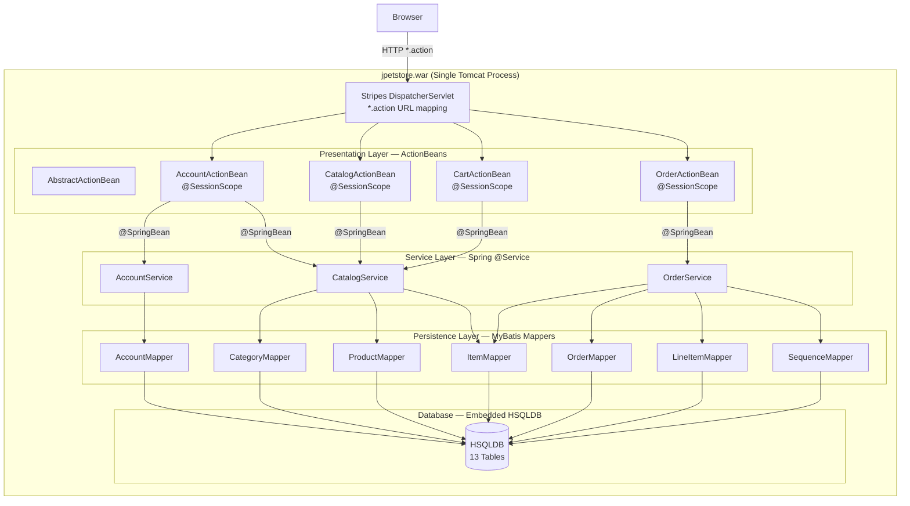
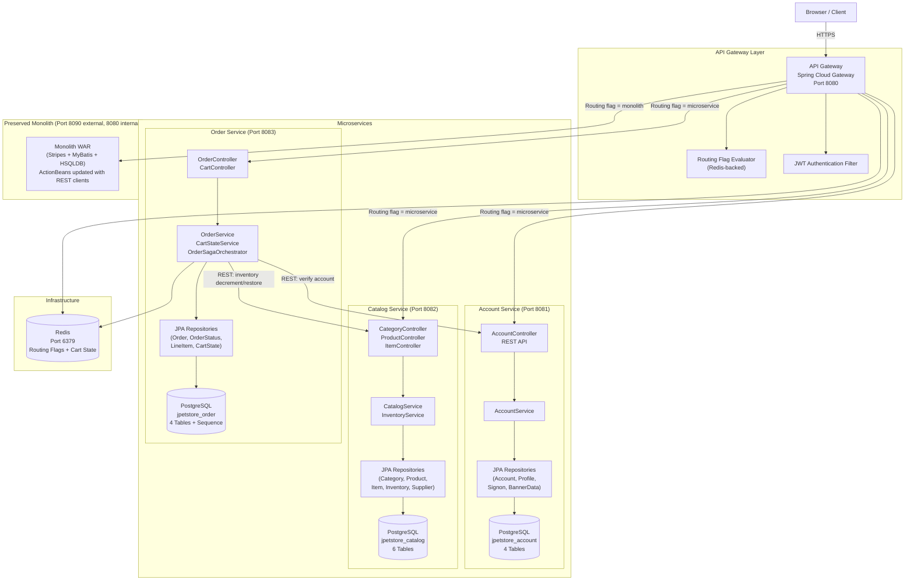
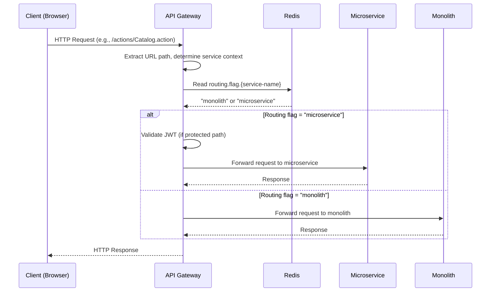
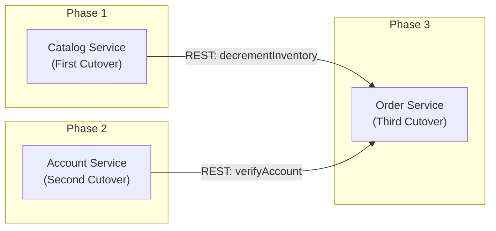
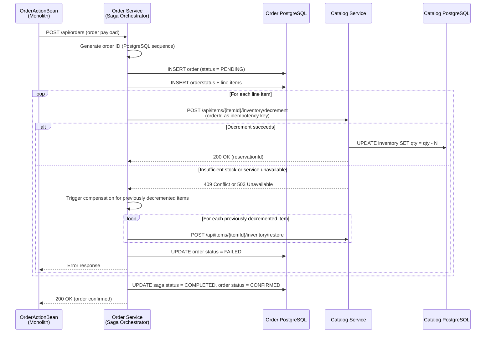
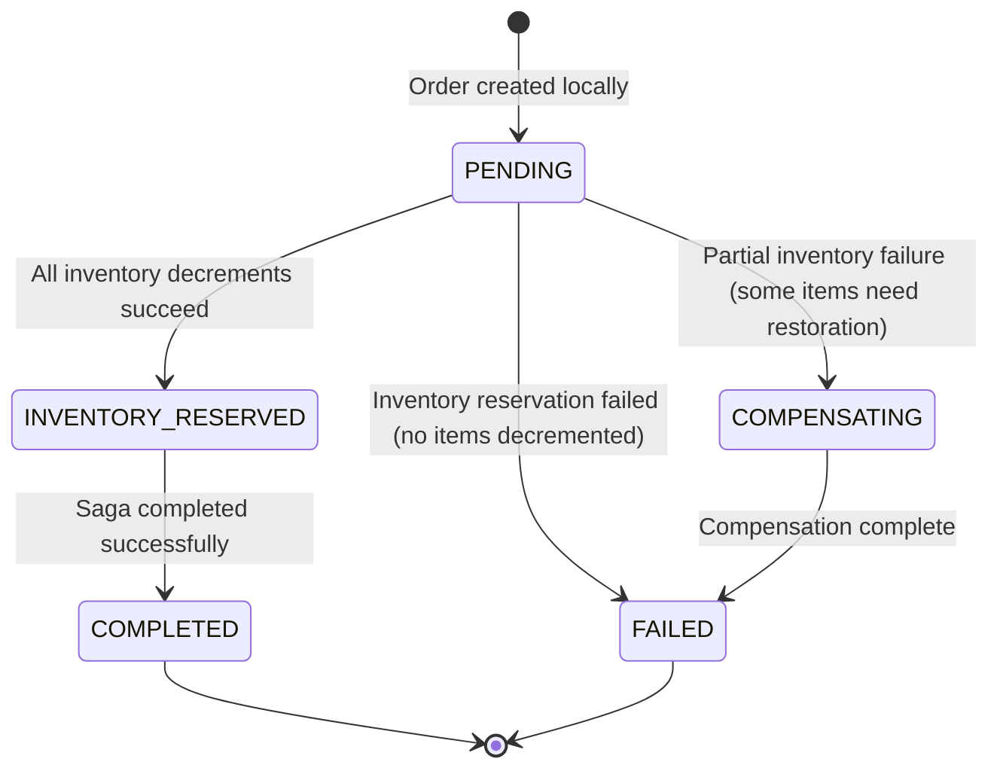
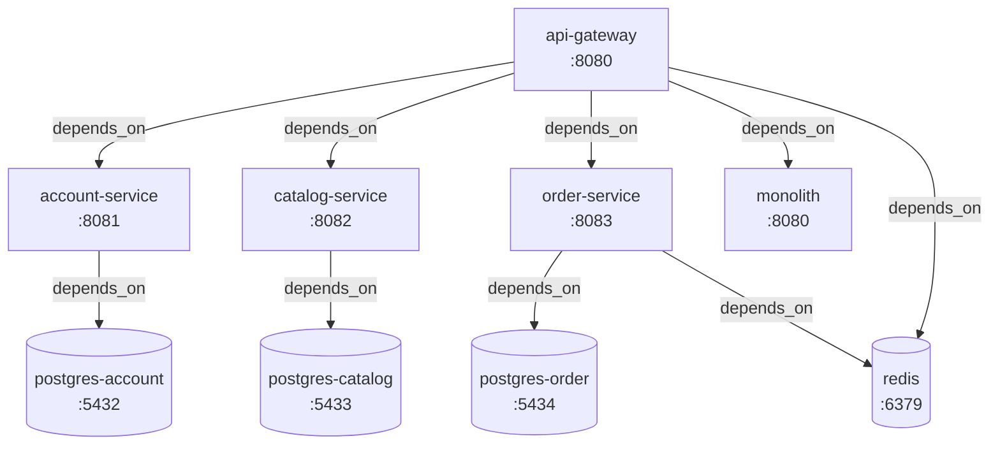
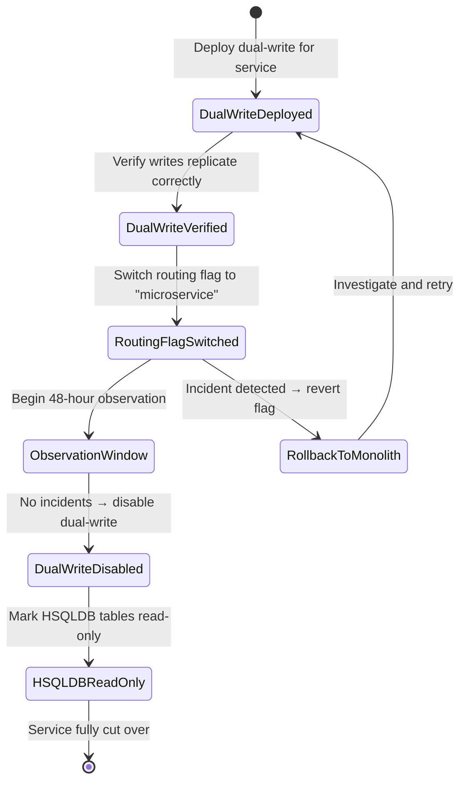

# JPetStore Microservices Architecture

## Introduction

This document describes the target architecture resulting from the **monolith-to-microservices decomposition** of the MyBatis JPetStore 6 application. The original application is a single-process, layered MVC monolith packaged as a WAR file deployed on Tomcat. It uses Stripes ActionBeans for request handling, Spring-managed service classes for business logic, MyBatis mapper interfaces for data access, and a single embedded HSQLDB database containing 13 tables. Server-side HTTP sessions manage authentication state and cart data.

The target architecture decomposes this monolith into **three independently deployable Spring Boot 3 microservices** — Account Service, Catalog Service, and Order Service — fronted by a **Spring Cloud Gateway API Gateway**. Each service owns its own PostgreSQL database, communicates via synchronous REST APIs, and uses Redis for externalized session and cart state. Authentication is handled via stateless JWT tokens.

The migration follows the **Strangler Fig pattern**: an API Gateway progressively routes traffic from the monolith to the new services via runtime-configurable per-service routing flags, one bounded context at a time. This enables incremental, independently verifiable, and reversible migration steps with zero business logic changes and no disruption to the seven core user workflows.

---

## Table of Contents

1. [High-Level Architecture](#1-high-level-architecture)
   - 1.1 [Current Monolith Architecture (Before)](#11-current-monolith-architecture-before)
   - 1.2 [Target Microservices Architecture (After)](#12-target-microservices-architecture-after)
   - 1.3 [Request Flow](#13-request-flow)
2. [Bounded Contexts](#2-bounded-contexts)
   - 2.1 [Account/User Management](#21-accountuser-management-bounded-context)
   - 2.2 [Catalog/Inventory](#22-cataloginventory-bounded-context)
   - 2.3 [Order/Cart](#23-ordercart-bounded-context)
3. [Strangler Fig Pattern Implementation](#3-strangler-fig-pattern-implementation)
   - 3.1 [API Gateway Routing](#31-api-gateway-routing)
   - 3.2 [Routing Flag Configuration](#32-routing-flag-configuration)
   - 3.3 [Cutover Order and Justification](#33-cutover-order-and-justification)
   - 3.4 [Coexistence Boundary Rules](#34-coexistence-boundary-rules)
4. [Database-per-Service Topology](#4-database-per-service-topology)
   - 4.1 [Database Ownership](#41-database-ownership)
   - 4.2 [Cross-Service Foreign Key Removal](#42-cross-service-foreign-key-removal)
   - 4.3 [Intra-Service Foreign Key Preservation](#43-intra-service-foreign-key-preservation)
   - 4.4 [Schema Management with Liquibase](#44-schema-management-with-liquibase)
5. [Inter-Service Communication Patterns](#5-inter-service-communication-patterns)
   - 5.1 [Synchronous REST Calls](#51-synchronous-rest-calls)
   - 5.2 [Fallback Behavior](#52-fallback-behavior)
6. [Distributed Transaction — Saga Pattern](#6-distributed-transaction--saga-pattern)
   - 6.1 [Current Monolith Transaction](#61-current-monolith-transaction)
   - 6.2 [Orchestration-Based Saga](#62-orchestration-based-saga)
   - 6.3 [Saga State Machine](#63-saga-state-machine)
   - 6.4 [Failure Scenarios and Compensation](#64-failure-scenarios-and-compensation)
   - 6.5 [Consistency Guarantees](#65-consistency-guarantees)
7. [Session State Externalization](#7-session-state-externalization)
   - 7.1 [Current Session State](#71-current-session-state)
   - 7.2 [Externalized Authentication — JWT](#72-externalized-authentication--jwt)
   - 7.3 [Externalized Cart State — Redis](#73-externalized-cart-state--redis)
   - 7.4 [ActionBean Adaptations](#74-actionbean-adaptations)
8. [Technology Stack](#8-technology-stack)
9. [Service Ports and Docker Compose Topology](#9-service-ports-and-docker-compose-topology)
10. [Dual-Write Coexistence Strategy](#10-dual-write-coexistence-strategy)
11. [Critical Architectural Rules](#11-critical-architectural-rules)

---

## 1. High-Level Architecture

### 1.1 Current Monolith Architecture (Before)

The original JPetStore 6 is a single WAR file deployed on Apache Tomcat. All components run in the same JVM process.



**Key Characteristics:**

- **Single deployment unit**: One WAR file, one Tomcat instance, one JVM
- **Stripes MVC**: `DispatcherServlet` routes all `*.action` requests to ActionBeans by convention
- **Spring DI via `@SpringBean`**: ActionBeans inject service classes through Stripes-Spring integration
- **Session-scoped state**: `AccountActionBean` holds `authenticated` flag and `account` object; `CartActionBean` holds the `Cart` instance; `OrderActionBean` reads both from the HTTP session
- **Single HSQLDB database**: All 13 tables in one schema, all accessed by one `DataSource`
- **MyBatis ORM**: 7 mapper interfaces + XML configurations with L2 cache on catalog mappers
- **Single `@Transactional` boundary**: `OrderService.insertOrder()` spans 4 tables across 2 bounded contexts in a single ACID transaction

### 1.2 Target Microservices Architecture (After)

The decomposed architecture replaces the monolith's internal in-process calls with REST API communication between independently deployable services.



### 1.3 Request Flow

The following diagram illustrates the request flow for a typical request during the Strangler Fig coexistence window:



---

## 2. Bounded Contexts

The monolith's 13 database tables and associated code are decomposed into three bounded contexts, each mapped to an independent microservice.

### 2.1 Account/User Management Bounded Context

| Property | Value |
|----------|-------|
| **Service** | Account Service |
| **Port** | 8081 |
| **Package** | `com.jpetstore.account` |
| **Owned Tables** | `account`, `profile`, `signon`, `bannerdata` (4 tables) |
| **Source Service Class** | `org.mybatis.jpetstore.service.AccountService` |
| **Source ActionBean** | `AccountActionBean` |
| **Database** | `jpetstore_account` (PostgreSQL) |

**Key Operations:**

| Operation | REST Endpoint | Description |
|-----------|--------------|-------------|
| Get Account | `GET /api/accounts/{username}` | Retrieve account by username (joins account + profile + bannerdata) |
| Sign On | `POST /api/accounts/signon` | Authenticate user; returns JWT token on success |
| Create Account | `POST /api/accounts` | 3-table transactional insert: account + profile + signon |
| Update Account | `PUT /api/accounts/{username}` | Update account and profile; conditionally update signon if password is non-empty |

**Authentication — JWT Token Issuance:**

The Account Service replaces the monolith's session-scoped `AccountActionBean.authenticated` flag with stateless JWT tokens. On successful sign-on:

1. Account Service validates credentials against the `signon` table
2. If valid, generates a JWT token containing `username` and `accountId` claims
3. Returns the token in the `SignonResponse` body
4. The monolith's updated `AccountActionBean` stores the token as an HTTP-only cookie
5. Subsequent requests include the JWT in the `Authorization: Bearer` header or cookie
6. The API Gateway's `AuthenticationFilter` validates the JWT on each request

**Personalization Note:**

In the monolith, `AccountActionBean` calls `catalogService.getProductListByCategory(account.getFavouriteCategoryId())` after sign-on, account creation, and account edit (lines 118, 140, 170) to populate the `myList` personalized product list. In the current microservices implementation, personalization is handled within the monolith's ActionBeans — the Account Service does **not** make a cross-service REST call to the Catalog Service for this purpose. A future enhancement could add a `CatalogServiceClient` to the Account Service for direct personalization support.

---

### 2.2 Catalog/Inventory Bounded Context

| Property | Value |
|----------|-------|
| **Service** | Catalog Service |
| **Port** | 8082 |
| **Package** | `com.jpetstore.catalog` |
| **Owned Tables** | `category`, `product`, `item`, `inventory`, `supplier`, `inventory_reservation` (6 tables) |
| **Source Service Class** | `org.mybatis.jpetstore.service.CatalogService` |
| **Source ActionBean** | `CatalogActionBean` |
| **Database** | `jpetstore_catalog` (PostgreSQL) |

**Key Operations:**

| Operation | REST Endpoint | Description |
|-----------|--------------|-------------|
| List Categories | `GET /api/categories` | Retrieve all categories |
| Get Category | `GET /api/categories/{id}` | Retrieve category by ID |
| List Products by Category | `GET /api/products?categoryId={id}` | Retrieve products filtered by category |
| Search Products | `GET /api/products/search?keywords={kw}` | Space-tokenized keyword search with `%keyword%` wildcard matching |
| Get Product | `GET /api/products/{id}` | Retrieve product by ID |
| List Items by Product | `GET /api/items?productId={id}` | Retrieve items filtered by product |
| Get Item | `GET /api/items/{id}` | Retrieve item by ID with product details |
| Check Inventory | `GET /api/items/{id}/inventory` | Check if item is in stock (`quantity > 0`) |
| Decrement Inventory | `POST /api/items/{id}/inventory/decrement` | Atomic inventory decrement (called by Order Service Saga) |
| Restore Inventory | `POST /api/items/{id}/inventory/restore` | Compensating action for failed orders |

**Keyword Search Implementation:**

The search operation replicates the monolith's `CatalogService.searchProductList()` logic:
1. Split the `keywords` string by whitespace (`\\s+`)
2. For each token, wrap with wildcards: `"%" + keyword.toLowerCase() + "%"`
3. Execute a `LIKE` query against product names
4. Aggregate results from all tokens

**Optimistic Locking for Inventory:**

The Catalog Service uses JPA `@Version` annotation on the `Inventory` entity for atomic inventory decrement. This replaces the MyBatis SQL pattern `UPDATE inventory SET qty = qty - #{increment}` and prevents lost-update race conditions under concurrent access.

**Authentication:**

All catalog endpoints are public. No authentication is required for browsing categories, searching products, or viewing items. The inventory decrement and restore endpoints are restricted to inter-service calls (service-to-service authentication).

---

### 2.3 Order/Cart Bounded Context

| Property | Value |
|----------|-------|
| **Service** | Order Service |
| **Port** | 8083 |
| **Package** | `com.jpetstore.order` |
| **Owned Tables** | `orders`, `orderstatus`, `lineitem`, `order_saga_state` (4 tables + PostgreSQL sequence `order_id_seq`) |
| **Source Service Class** | `org.mybatis.jpetstore.service.OrderService` |
| **Source ActionBeans** | `CartActionBean`, `OrderActionBean` |
| **Database** | `jpetstore_order` (PostgreSQL) |

**Key Operations:**

| Operation | REST Endpoint | Description |
|-----------|--------------|-------------|
| Place Order | `POST /api/orders` | Create order with Saga orchestration (distributed transaction) |
| List Orders | `GET /api/orders?username={user}` | Retrieve orders by username |
| Get Order | `GET /api/orders/{id}` | Retrieve order by ID with line items |
| Get Cart | `GET /api/cart/{sessionId}` | Retrieve externalized cart state |
| Add to Cart | `POST /api/cart/{sessionId}/items` | Add item to externalized cart |
| Remove from Cart | `DELETE /api/cart/{sessionId}/items/{itemId}` | Remove item from cart |
| Update Cart | `PUT /api/cart/{sessionId}` | Update cart quantities |

**Cross-Service Dependencies:**

| Target Service | Endpoint | Purpose |
|---------------|----------|---------|
| Catalog Service | `POST /api/items/{id}/inventory/decrement` | Reserve inventory during order placement (Saga step) |
| Catalog Service | `POST /api/items/{id}/inventory/restore` | Compensate inventory on order failure |
| Catalog Service | `GET /api/items/{id}` | Retrieve item details for order line items |
| Account Service | `GET /api/accounts/{username}` | Verify account exists during order placement |

**Sequence Table Replacement:**

The monolith's `sequence` table uses a non-thread-safe read-then-update pattern in `OrderService.getNextId()`:

```java
// Monolith: Race condition risk under concurrent access
Sequence sequence = sequenceMapper.getSequence(new Sequence(name, -1));
sequenceMapper.updateSequence(new Sequence(name, sequence.getNextId() + 1));
return sequence.getNextId();
```

This is replaced by a PostgreSQL native sequence:

```sql
CREATE SEQUENCE order_id_seq START WITH <max_migrated_order_id + 1000>;
```

The JPA entity uses:

```java
@GeneratedValue(strategy = GenerationType.SEQUENCE, generator = "order_seq")
@SequenceGenerator(name = "order_seq", sequenceName = "order_id_seq")
```

This provides atomic, thread-safe, database-guaranteed ID generation. The `sequence` table is not migrated and is decommissioned after Order Service cutover.

---

## 3. Strangler Fig Pattern Implementation

The Strangler Fig pattern enables incremental migration from the monolith to microservices. The API Gateway acts as the façade, routing traffic to either the monolith or the new services based on runtime-configurable flags.

### 3.1 API Gateway Routing

The API Gateway (Spring Cloud Gateway, port 8080) is the single public entry point. It replaces direct access to the monolith's Stripes `DispatcherServlet`.

**URL Pattern Routing Table:**

| URL Pattern | Routing Flag Key | Monolith Target | Microservice Target |
|------------|-----------------|-----------------|---------------------|
| `/actions/Account.action*` | `routing.flag.account-service` | `http://monolith:8080` | `http://account-service:8081` |
| `/actions/Catalog.action*` | `routing.flag.catalog-service` | `http://monolith:8080` | `http://catalog-service:8082` |
| `/actions/Cart.action*` | `routing.flag.order-service` | `http://monolith:8080` | `http://order-service:8083` |
| `/actions/Order.action*` | `routing.flag.order-service` | `http://monolith:8080` | `http://order-service:8083` |
| `/css/**`, `/images/**` | _(always monolith)_ | `http://monolith:8080` | N/A |
| `/api/accounts/**` | _(always microservice)_ | N/A | `http://account-service:8081` |
| `/api/catalog/**` | _(always microservice)_ | N/A | `http://catalog-service:8082` |
| `/api/orders/**` | _(always microservice)_ | N/A | `http://order-service:8083` |
| `/api/cart/**` | _(always microservice)_ | N/A | `http://order-service:8083` |

**Authentication Enforcement:**

- **Protected paths** (`/actions/Order.action*`, `/actions/Account.action?editAccount*`, `/api/orders/**`): The `JwtAuthenticationFilter` validates the JWT token from the `Authorization` header or HTTP-only cookie before forwarding
- **Public paths** (`/actions/Catalog.action*`, `/actions/Account.action?signonForm*`, `/actions/Cart.action*`, `/api/catalog/**`): Authentication is optional — the filter passes through without a token
- This mirrors the monolith's behavior where `OrderActionBean.newOrderForm()` checks `accountBean.isAuthenticated()` before proceeding

**Fallback behavior**: If a target microservice is unreachable, the gateway returns `503 Service Unavailable`. The routing flag can be immediately reverted to `"monolith"` via a Redis CLI command or admin endpoint.

### 3.2 Routing Flag Configuration

Per-service routing flags are stored in Redis and are runtime-switchable without redeployment or restart of any component.

```
Redis Keys:
  routing.flag.account-service = "monolith"   (or "microservice")
  routing.flag.catalog-service = "monolith"   (or "microservice")
  routing.flag.order-service   = "monolith"   (or "microservice")
```

- **Cache TTL**: 1 second (local cache to reduce Redis call overhead)
- **Flag switch**: Immediate effect — changing a Redis key value redirects all subsequent traffic for that service within 1 second
- **No redeployment required**: Flags are read at runtime on every request (with short cache)
- **Default value**: `"monolith"` — all traffic goes to the monolith until explicitly switched

### 3.3 Cutover Order and Justification

The services are cut over one at a time in the following order, justified by dependency analysis and risk assessment:

**1. Catalog Service (First) — Lowest Risk**

- Predominantly read-only operations (browse categories, search products, view items)
- The only write operation is `updateInventoryQuantity()`, exclusively called from `OrderService.insertOrder()` — but the Order Service is cut over last, so this write path remains in the monolith during Catalog's cutover
- No dependencies on other bounded contexts
- Validates the entire infrastructure pattern (Docker, PostgreSQL, API Gateway routing, dual-write) on the simplest service
- Provides the REST API that Account Service and Order Service will later depend on

**2. Account Service (Second) — Medium Risk**

- Involves write operations (registration, account update) but is self-contained within its 4 tables
- No outbound dependencies on other microservices (personalization is handled within the monolith's ActionBeans)
- Validates JWT-based authentication and session externalization patterns
- Provides the authentication REST API that Order Service will depend on

**3. Order Service (Last) — Highest Risk**

- Contains the distributed order transaction (Saga pattern), which is the most complex component
- Depends on both Catalog Service (inventory decrement) and Account Service (user verification) — both are already live microservices
- Requires the Saga orchestrator, externalized cart state, and cross-service coordination
- Benefits from lessons learned during Catalog and Account cutovers



### 3.4 Coexistence Boundary Rules

The following strict boundaries apply during the Strangler Fig coexistence window:

1. **Monolith preservation**: The original monolith WAR remains deployable and fully functional for any bounded context not yet cut over
2. **Limited monolith changes**: The only permitted changes to the monolith are: (a) updating ActionBeans to call REST APIs for already-extracted services, and (b) adding HTTP client dependencies to `pom.xml`
3. **No cross-database access**: No service may access another service's database directly — all cross-service data access goes through the owning service's REST API
4. **Dual-write prerequisite**: Dual-write must be deployed and verified before any routing flag is switched
5. **Observation window**: No data in HSQLDB is modified or deleted until the final cutover of a service is confirmed and its post-cutover 48-hour observation window has passed
6. **Rollback safety**: At any point before dual-write is disabled, reverting the routing flag to `"monolith"` is sufficient for rollback — no data rollback required because dual-write keeps both stores consistent

---

## 4. Database-per-Service Topology

Each microservice owns an exclusive PostgreSQL database. No service queries another service's database directly.

### 4.1 Database Ownership

| Database | Service | Port | Tables | Table Count |
|----------|---------|------|--------|-------------|
| `jpetstore_account` | Account Service | 5432 | `account`, `profile`, `signon`, `bannerdata` | 4 |
| `jpetstore_catalog` | Catalog Service | 5433 | `category`, `product`, `item`, `inventory`, `supplier`, `inventory_reservation` | 6 |
| `jpetstore_order` | Order Service | 5434 | `orders`, `orderstatus`, `lineitem`, `order_saga_state` | 4 (+sequence) |

**Total**: 14 tables distributed across 3 databases (the `sequence` table from the monolith is replaced by PostgreSQL native sequences and is not migrated). Additionally, `inventory_reservation` and `order_saga_state` are new PostgreSQL-only tables supporting the inventory reservation idempotency and Saga orchestration patterns respectively.

### 4.2 Cross-Service Foreign Key Removal

The following foreign keys existed in the monolith's single database across bounded context boundaries. They are **removed as database constraints** in the decomposed architecture and enforced at the application layer:

| Former FK | Source Table (Service) | Target Table (Service) | Enforcement After Decomposition |
|-----------|----------------------|------------------------|-------------------------------|
| `lineitem.itemid → item.itemid` | `lineitem` (Order Service) | `item` (Catalog Service) | `itemid` stored as plain `varchar` in Order Service; validated via `GET /api/items/{id}` REST call to Catalog Service during order placement |
| `orders.userid → account.userid` | `orders` (Order Service) | `account` (Account Service) | `userid` stored as plain `varchar` in Order Service; validated via `GET /api/accounts/{username}` REST call to Account Service during order placement |

### 4.3 Intra-Service Foreign Key Preservation

Foreign keys that remain within a single service's database are preserved as standard database constraints:

| FK Constraint | Table.Column → Referenced Table.Column | Service |
|---------------|---------------------------------------|---------|
| `fk_product_1` | `product.category → category.catid` | Catalog Service |
| `fk_item_1` | `item.productid → product.productid` | Catalog Service |
| `fk_item_2` | `item.supplier → supplier.suppid` | Catalog Service |

### 4.4 Schema Management with Liquibase

Each service manages its own database schema using Liquibase changelogs:

```
{service}/src/main/resources/db/changelog/
├── db.changelog-master.xml        # Master changelog (includes all changesets)
└── 001-initial-schema.xml         # Initial table creation changeset
```

- **Master changelog** (`db.changelog-master.xml`): References all changeset files in order
- **Initial schema** (`001-initial-schema.xml`): Creates the service's tables with PostgreSQL-native types, indexes, and constraints
- **Column naming convention**: Column naming varies by service — Account and Catalog services retain HSQLDB-identical column names (e.g., `favcategory`, `listprice`) for migration data consistency, while the Order service uses `snake_case` (e.g., `order_id`, `ship_addr1`, `bill_to_first_name`). See `migration/mapping/column-mapping-manifest.md` for the complete column mapping.
- **Type mapping**: HSQLDB types are mapped to PostgreSQL equivalents — `VARCHAR` → `varchar`, `INTEGER` → `integer`, `NUMERIC(10,2)` → `numeric(10,2)`, `TIMESTAMP` → `timestamp with time zone`

---

## 5. Inter-Service Communication Patterns

All inter-service communication uses synchronous REST over HTTP. No asynchronous messaging is used. This design decision is justified because all cross-service interactions produce results needed immediately for page rendering — introducing async messaging would require loading states, which would change the user-facing workflow (prohibited).

### 5.1 Synchronous REST Calls

| Calling Service | Target Service | HTTP Method | Endpoint | Purpose |
|----------------|---------------|-------------|----------|---------|
| Order Service | Catalog Service | `POST` | `/api/items/{id}/inventory/decrement` | Inventory decrement during order placement (Saga step 2) |
| Order Service | Catalog Service | `POST` | `/api/items/{id}/inventory/restore` | Compensating action for failed/rolled-back orders |
| Order Service | Catalog Service | `GET` | `/api/items/{id}` | Retrieve item details for order line items |
| Order Service | Account Service | `GET` | `/api/accounts/{username}` | Verify account exists during order placement |
| API Gateway | Account Service | `POST` | `/api/accounts/signon` | Token validation and generation |

### 5.2 Fallback Behavior

Each cross-service call has defined fallback behavior when the target service is unavailable:

| Calling Service → Target | Failure Behavior | User Impact |
|--------------------------|-----------------|-------------|
| Order Service → Catalog Service | Order placement fails; order status set to `FAILED` | User sees error message; can retry when Catalog Service recovers |
| Order Service → Account Service | Order placement fails; order not created | User sees error message; can retry when Account Service recovers |
| API Gateway → any microservice | `503 Service Unavailable` returned; routing flag can be reverted to `"monolith"` | Service temporarily unavailable; operator can switch back to monolith |

---

## 6. Distributed Transaction — Saga Pattern

The most complex aspect of the decomposition is replacing the monolith's single ACID transaction in `OrderService.insertOrder()` with a distributed transaction using the orchestration-based Saga pattern.

### 6.1 Current Monolith Transaction

In the monolith, `OrderService.insertOrder()` executes **2N+4 SQL operations** in a single `@Transactional` boundary (where N = number of line items):

| Step | Operation | Table(s) | Bounded Context |
|------|-----------|----------|-----------------|
| 1 | `getNextId("ordernum")` — read sequence | `sequence` | Order |
| 2 | `updateSequence()` — increment sequence | `sequence` | Order |
| 3 | N × `itemMapper.updateInventoryQuantity()` | `inventory` | **Catalog** (cross-boundary!) |
| 4 | `orderMapper.insertOrder()` | `orders` | Order |
| 5 | `orderMapper.insertOrderStatus()` | `orderstatus` | Order |
| 6 | N × `lineItemMapper.insertLineItem()` | `lineitem` | Order |

**Critical risk**: Steps 3 (inventory decrement) and steps 4–6 (order writes) target tables owned by two different bounded contexts. After decomposition, these tables reside in separate PostgreSQL databases owned by separate services — a single ACID transaction is impossible.

### 6.2 Orchestration-Based Saga

The Order Service acts as the Saga orchestrator, coordinating local and remote operations:



**Saga Steps:**

1. **Step 1 — Create Order (Local)**: Generate order ID via PostgreSQL sequence. Insert order record with `status = PENDING`, insert `orderstatus` and `lineitem` records. This creates a durable record of the attempt.
2. **Step 2 — Reserve Inventory (Remote)**: For each line item, call `POST /api/items/{itemId}/inventory/decrement` on the Catalog Service. Each request includes the `orderId` as an idempotency key to prevent double-decrement on retries.
3. **Step 3a — Confirm (Success)**: If all inventory reservations succeed, update the saga state to `COMPLETED` and the order status to `CONFIRMED`.
4. **Step 3b — Compensate (Failure)**: If any reservation fails, trigger `InventoryCompensation` to restore previously decremented items, then update the order status to `FAILED`.

**Order-first sequencing justification**: The order record is written first (in `PENDING` state) so there is always a durable record of the attempt. This prevents "phantom decrements" where inventory is reserved but no order record exists.

### 6.3 Saga State Machine

The `OrderSagaState` entity persists the Saga's progress to enable recovery from failures at any step:



> **Important distinction**: The `OrderSagaState` entity tracks saga progress using these states (`PENDING`, `INVENTORY_RESERVED`, `COMPLETED`, `COMPENSATING`, `FAILED`). The `Order` entity's own `status` field uses different values (`PENDING`, `CONFIRMED`, `FAILED`). When the saga reaches `COMPLETED`, the corresponding order status is set to `CONFIRMED`.

**State Descriptions:**

| Saga State | Description |
|------------|-------------|
| `PENDING` | Order record created locally; inventory reservation in progress |
| `INVENTORY_RESERVED` | All inventory decrements succeeded; awaiting final confirmation |
| `COMPLETED` | Saga completed successfully; order status set to `CONFIRMED`; inventory decremented; transaction complete |
| `COMPENSATING` | Partial failure detected; restoring previously decremented inventory |
| `FAILED` | Order failed; all inventory restored (or none was decremented); no data inconsistency |

### 6.4 Failure Scenarios and Compensation

| Failure Scenario | Inventory State | Order State | Compensation Action |
|-----------------|----------------|-------------|-------------------|
| Order writes succeed, inventory reservation fails (all items) | No decrement occurred | `PENDING` → `FAILED` | None needed — no inventory was decremented |
| Order writes succeed, inventory partially succeeds | Some items decremented | `PENDING` → `COMPENSATING` → `FAILED` | Call `POST /api/items/{id}/inventory/restore` for each successfully decremented item |
| Order writes succeed, inventory succeeds, confirmation write fails | All items decremented | `PENDING` (stuck) | Reconciliation job detects orders in `PENDING` state beyond 60s threshold; queries Catalog Service for reservation status; confirms or fails accordingly |
| Catalog Service completely unavailable | No decrement occurred | `PENDING` → `FAILED` | None needed — user can retry when Catalog Service recovers |

**Idempotency guarantee**: Every inventory reservation request includes the `orderId` as an idempotency key. The Catalog Service stores reservation records indexed by `orderId` and returns success for duplicate requests without double-decrementing. This enables safe retry of Saga steps.

### 6.5 Consistency Guarantees

- A **confirmed** order (`status = CONFIRMED`) always has a corresponding inventory decrement for every line item
- A **failed** order (`status = FAILED`) never has uncompensated inventory decrements
- The `PENDING → CONFIRMED / FAILED` state machine is the **single source of truth** for order transaction status
- A reconciliation job provides eventual consistency for the narrow failure window between reservation success and confirmation write

---

## 7. Session State Externalization

The monolith uses server-side HTTP sessions (`@SessionScope` ActionBeans) to manage authentication state and cart data. The decomposed architecture externalizes this state to enable stateless services.

### 7.1 Current Session State

In the monolith, three session-scoped ActionBeans are tightly coupled:

| ActionBean | Scope | State Held |
|-----------|-------|------------|
| `AccountActionBean` | `@SessionScope` | `account` (Account object), `username`, `password`, `myList` (personalized products), `authenticated` (boolean flag) |
| `CartActionBean` | `@SessionScope` | `cart` (Cart object with `Map<String, CartItem> itemMap`) |
| `OrderActionBean` | `@SessionScope` | Reads from both `AccountActionBean` and `CartActionBean` via `session.getAttribute()` |

**Session coupling in OrderActionBean:**

```java
// OrderActionBean.newOrderForm() - reads from other session-scoped beans
AccountActionBean accountBean = (AccountActionBean) session.getAttribute("/actions/Account.action");
CartActionBean cartBean = (CartActionBean) session.getAttribute("/actions/Cart.action");
order.initOrder(accountBean.getAccount(), cartBean.getCart());
```

```java
// OrderActionBean.listOrders() - reads account from session
AccountActionBean accountBean = (AccountActionBean) session.getAttribute("/actions/Account.action");
orderList = orderService.getOrdersByUsername(accountBean.getAccount().getUsername());
```

```java
// OrderActionBean.viewOrder() - reads account from session (alternate attribute name)
AccountActionBean accountBean = (AccountActionBean) session.getAttribute("accountBean");
```

### 7.2 Externalized Authentication — JWT

| Aspect | Details |
|--------|---------|
| **Mechanism** | JWT (JSON Web Token) issued by Account Service |
| **Claims** | `username`, `accountId` |
| **Storage** | HTTP-only cookie (preserves JSP compatibility — no JSP changes needed) |
| **Validation** | API Gateway's `JwtAuthenticationFilter` validates on every request |
| **Library** | jjwt (io.jsonwebtoken) version 0.12.6 |

**Flow:**

1. User submits credentials via `SignonForm.jsp` → `AccountActionBean.signon()`
2. Updated `AccountActionBean` sends `POST /api/accounts/signon` to Account Service
3. Account Service validates credentials, generates JWT, returns `SignonResponse` with token
4. `AccountActionBean` stores JWT as HTTP-only cookie in the response
5. All subsequent requests include the JWT cookie
6. API Gateway extracts and validates the JWT, passes `username` claim as a request header to downstream services

**Replaces**: `AccountActionBean.authenticated` boolean flag and session-scoped `account` object.

### 7.3 Externalized Cart State — Redis

| Aspect | Details |
|--------|---------|
| **Storage** | Redis, accessed via Order Service REST API |
| **Key scheme** | Session cookie ID (anonymous) or `username` (authenticated) |
| **Operations** | Add item, remove item, update quantities, get cart, clear cart |
| **Cart merge** | On login, anonymous cart (keyed by session ID) is merged into user's persistent cart (keyed by username) |

**Preserves existing behavior**: Unauthenticated users can browse and build a cart before signing in. The anonymous cart is identified by a session cookie and merged into the user's account-based cart upon login.

**Cart state endpoints** (Order Service):

| Method | Endpoint | Description |
|--------|----------|-------------|
| `GET` | `/api/cart/{sessionId}` | Retrieve current cart state |
| `POST` | `/api/cart/{sessionId}/items` | Add item to cart |
| `DELETE` | `/api/cart/{sessionId}/items/{itemId}` | Remove item from cart |
| `PUT` | `/api/cart/{sessionId}` | Update cart item quantities |

### 7.4 ActionBean Adaptations

The monolith's ActionBeans are updated to use REST clients instead of `@SpringBean` service injection:

| ActionBean | Before (Monolith) | After (REST Client) |
|-----------|-------------------|---------------------|
| `AccountActionBean` | `@SpringBean AccountService`, `@SpringBean CatalogService` | REST client calls to Account Service and Catalog Service; JWT cookie management |
| `CatalogActionBean` | `@SpringBean CatalogService` | REST client calls to Catalog Service |
| `CartActionBean` | `@SpringBean CatalogService` | REST client calls for item lookup via Catalog Service; externalized cart via Order Service |
| `OrderActionBean` | `@SpringBean OrderService`, reads `AccountActionBean` and `CartActionBean` from session | REST client calls to Order Service; reads auth from JWT cookie; reads cart from Order Service REST API |

**JSP Compatibility**: ActionBean property names and types visible to JSPs remain unchanged. EL expressions and JSTL tags continue to resolve correctly. No JSP templates are modified.

---

## 8. Technology Stack

### New Microservices Stack

| Component | Technology | Version | Notes |
|-----------|-----------|---------|-------|
| Runtime | Java | 17 | OpenJDK (eclipse-temurin:17 Docker image) |
| Framework | Spring Boot 3 | 3.5.12 | Latest stable 3.5.x; manages dependency versions via BOM |
| ORM | Spring Data JPA (Hibernate) | BOM-managed | Replaces MyBatis mappers in new services |
| Database | PostgreSQL | 16 | One instance per service |
| Schema Management | Liquibase | 4.31.0 (BOM) | Database-as-code via XML changelogs |
| API Gateway | Spring Cloud Gateway | 4.2.2 | Spring Cloud 2025.0.1 BOM |
| Cache / State Store | Redis | 7 | Routing flags, cart state, session externalization |
| Authentication | JWT (jjwt) | 0.12.6 | `jjwt-api`, `jjwt-impl`, `jjwt-jackson` |
| Validation | Jakarta Bean Validation | BOM-managed | `spring-boot-starter-validation` |
| Health Checks | Spring Boot Actuator | BOM-managed | Health, readiness, and liveness probes |
| Testing | JUnit 5 + Mockito + Testcontainers | BOM-managed | Testcontainers 1.20.4 for PostgreSQL integration tests |
| Build Tool | Maven | 3.9.x | Multi-module parent POM |
| Containers | Docker | — | Multi-stage builds with eclipse-temurin:17 |

### Preserved Monolith Stack

| Component | Technology | Version | Notes |
|-----------|-----------|---------|-------|
| Runtime | Java | 17 | Same JDK as new services |
| MVC Framework | Stripes | 1.6.0 | ActionBean-based request handling |
| ORM | MyBatis | 3.5.19 | Mapper interfaces + XML configurations |
| Spring Integration | mybatis-spring | 3.0.5 | Spring-MyBatis bridge |
| Spring Core | Spring Context | 6.2.17 | IoC container |
| Spring Web | spring-web | 5.3.39 | Pinned for javax.servlet compatibility |
| Database | HSQLDB | 2.7.4 | Embedded database |
| Servlet API | Jakarta Servlet API | 4.0.4 | javax.servlet namespace |
| HTTP Client | RestTemplate (spring-web) | 5.3.39 | Used for REST calls to microservices |
| JSON | Jackson Databind | 2.18.3 | JSON serialization/deserialization for REST |
| Testing | JUnit Jupiter | 6.0.3 | With Mockito 5.23.0, AssertJ 3.27.7 |

### Namespace Separation

The monolith and new services use different Java EE namespaces:

| Aspect | Monolith | New Services |
|--------|----------|-------------|
| **Namespace** | `javax.*` | `jakarta.*` |
| **Servlet API** | `javax.servlet` (4.0.4) | `jakarta.servlet` (6.x) |
| **Validation** | `javax.validation` (Stripes `@Validate`) | `jakarta.validation` (Bean Validation 3.0) |
| **Persistence** | MyBatis (no JPA) | `jakarta.persistence` (JPA 3.1) |

These are completely separate compilation units with no shared classpath. Domain POJOs copied from the monolith into new services have `javax.validation` annotations replaced with `jakarta.validation` equivalents.

---

## 9. Service Ports and Docker Compose Topology

### Service Port Assignments

| Service | Container Port | Host Port | Docker Service Name | Base Image |
|---------|---------------|-----------|---------------------|------------|
| API Gateway | 8080 | 8080 | `api-gateway` | eclipse-temurin:17 |
| Account Service | 8081 | 8081 | `account-service` | eclipse-temurin:17 |
| Catalog Service | 8082 | 8082 | `catalog-service` | eclipse-temurin:17 |
| Order Service | 8083 | 8083 | `order-service` | eclipse-temurin:17 |
| Monolith | 8080 | 8090 | `monolith` | openjdk:17-slim |
| PostgreSQL (Account) | 5432 | 5432 | `postgres-account` | postgres:16 |
| PostgreSQL (Catalog) | 5432 | 5433 | `postgres-catalog` | postgres:16 |
| PostgreSQL (Order) | 5432 | 5434 | `postgres-order` | postgres:16 |
| Redis | 6379 | 6379 | `redis` | redis:7 |

### Docker Compose Service Dependency Graph



### Service Environment Configuration

Each microservice receives its configuration via `application.yml` with the following key settings:

| Configuration | Account Service | Catalog Service | Order Service |
|--------------|----------------|----------------|---------------|
| PostgreSQL URL | `jdbc:postgresql://postgres-account:5432/jpetstore_account` | `jdbc:postgresql://postgres-catalog:5432/jpetstore_catalog` | `jdbc:postgresql://postgres-order:5432/jpetstore_order` |
| Redis URL | `redis://redis:6379` | N/A | `redis://redis:6379` |
| JWT Secret | Configured | N/A | N/A |
| Inter-service URLs | N/A | N/A | Account Service + Catalog Service base URLs |

---

## 10. Dual-Write Coexistence Strategy

During the Strangler Fig coexistence window, every write to a newly extracted service must be reflected in both PostgreSQL (primary) and HSQLDB (secondary) to ensure safe rollback at any point.

> **Full details**: See [migration-guide.md](migration-guide.md) for the complete dual-write procedure, data migration steps, and validation gate checklist.

### Summary

| Aspect | Configuration |
|--------|--------------|
| **Write propagation direction** | PostgreSQL (primary) → HSQLDB (secondary) |
| **Propagation mode** | Asynchronous |
| **Maximum acceptable lag** | ≤ 5 seconds |
| **Conflict detection** | `last_modified_timestamp` comparison on each row |
| **Conflict resolution** | If HSQLDB row has a newer timestamp than the propagated write, the HSQLDB row is NOT overwritten; a conflict alert is triggered for manual investigation |
| **Observation window** | 48 hours post-cutover with no incidents before dual-write can be disabled |
| **Disabling dual-write** | Set `dualwrite.enabled=false` per service via configuration (no redeployment) |

### Dual-Write Lifecycle Per Service



### Rollback Safety

- **Before dual-write is disabled**: Revert the routing flag to `"monolith"` via Redis. No data rollback required because dual-write kept both stores consistent.
- **After dual-write is disabled**: Rollback to the monolith path is **no longer safe**. This is the point of no return for a given service.

---

## 11. Critical Architectural Rules

The following invariants must be maintained throughout the decomposition and coexistence period:

### Zero Business Logic Change

- All seven core workflows (registration, authentication, catalog browsing, product search, cart management, checkout, order history) behave identically after decomposition
- No domain rule, validation logic, or computation is altered in any service or ActionBean
- The simulated payment logic (hardcoded credit card types: Visa, MasterCard, American Express) is preserved exactly
- All queries produce identical result sets against the migrated PostgreSQL data

### Monolith Preservation

- The monolith's service classes (`AccountService`, `CatalogService`, `OrderService`) are **NOT modified**
- The monolith's mapper interfaces (7 interfaces) and mapper XML files (7 files) are **NOT modified**
- The monolith's Spring configuration (`applicationContext.xml`) and database layer are **NOT modified**
- Only ActionBeans may be updated (to call REST APIs for extracted services)
- Only `pom.xml` may be updated (to add HTTP client dependencies)

### JSP View Template Preservation

- All 20 JSP files under `src/main/webapp/WEB-INF/jsp/` are **NOT modified**
- ActionBean property names and types visible to JSPs remain unchanged
- EL expressions and JSTL tags continue to resolve correctly
- No migration to a different UI framework

### Database Isolation

- No service accesses another service's database directly
- All cross-service data access goes through the owning service's REST API
- Cross-service foreign keys are removed as database constraints and enforced at the application layer
- No shared database schemas, tables, or connections between services

### Namespace Separation

- New services use the `jakarta.*` namespace (Jakarta EE 10)
- The monolith uses the `javax.*` namespace
- These are completely separate compilation units with no shared classpath

### Data Integrity

- Zero data loss throughout migration — every row in all 13 HSQLDB tables is verifiably present in the target PostgreSQL databases
- The data integrity validation gate (7 checks) must pass completely before any service cutover
- All PostgreSQL sequence starting values exceed the maximum migrated ID to prevent collisions

### Test Coverage

- New service code achieves > 80% test coverage
- All intra-service write operations are atomic
- The distributed order transaction (Saga) is verified by integration tests simulating failure scenarios
- No N+1 query patterns in new service implementations
- Existing monolith tests (18 test files, 84 tests) continue to pass without modification
